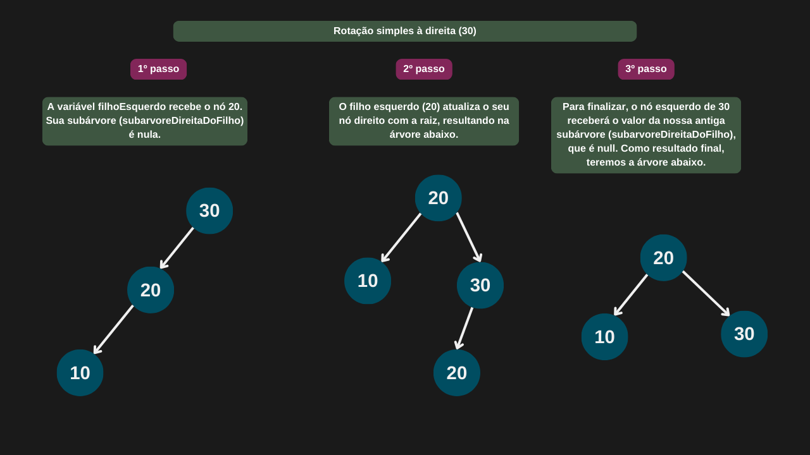
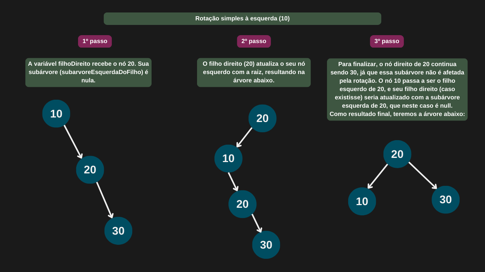
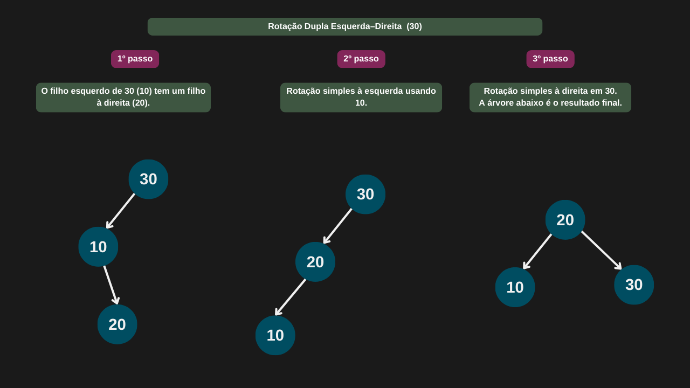
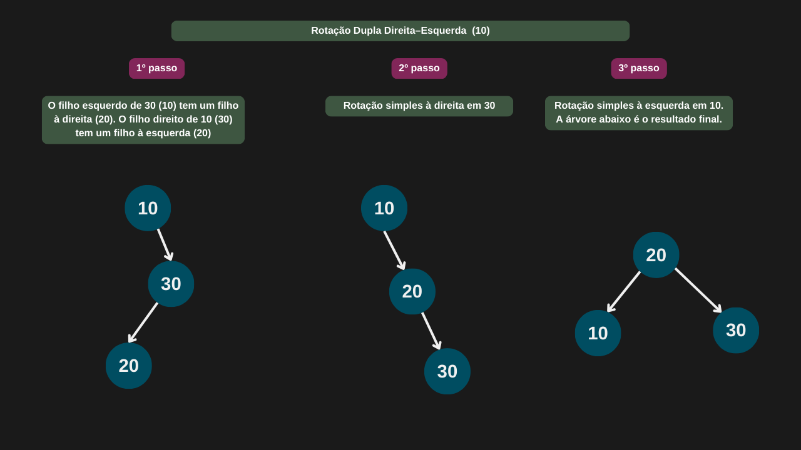
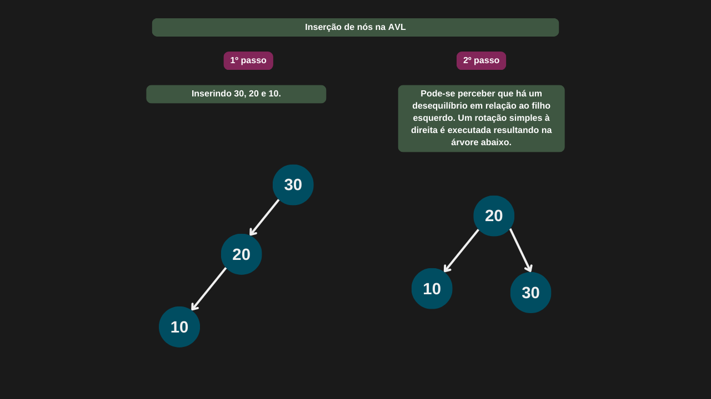
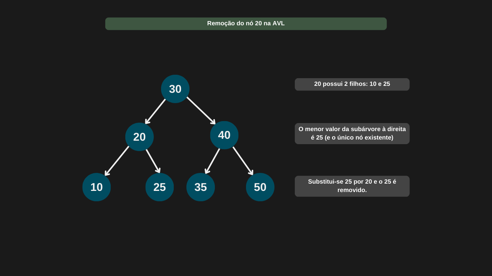
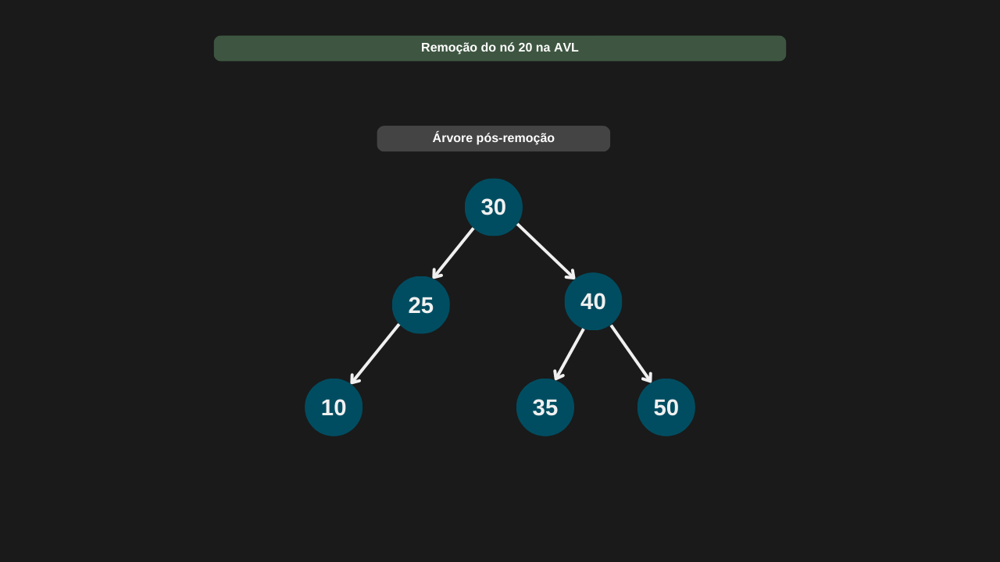

---

comments: true

---

# **Árvores de Pesquisa Binária Balanceada (AVL)**

Uma árvore AVL é uma árvore binária de busca autobalanceada. À medida que inserimos e removemos nós, o objetivo é mantê-la balanceada utilizando rotações à esquerda e/ou à direita.

Para determinar se uma rotação é necessária, usamos o fator de balanceamento em cada nó. Esse fator pode assumir os seguintes valores:

- -1: indica que a subárvore direita está levemente mais alta

- 0: indica que o nó está balanceado

- 1: indica que a subárvore esquerda está levemente mais alta

O fator de balanceamento (FB) é calculado com a fórmula:
`FB = altura(subárvore esquerda) - altura(subárvore direita)`

Se após uma operação (inserção ou remoção) o fator de balanceamento de algum nó ultrapassar o intervalo de `-1` a `1`, a árvore executará uma ou mais rotações para restaurar o equilíbrio.

Cada nó da árvore possui um atributo de altura, que serve de apoio no cálculo do fator de balanceamento e facilita o controle do balanceamento da árvore.

```csharp

public class NoAvl(int valor)
{
    public int Valor = valor;
    public NoAvl? NoEsquerdo;
    public NoAvl? NoDireito;
    public int Altura = 1;
}

```

## **Tipos de Rotações**

Existem quatro tipos de rotações fundamentais em árvores AVL, utilizadas para corrigir desequilíbrios:

1. **Rotação simples à direita (RR):** aplicada quando o desbalanceamento ocorre no filho esquerdo do filho esquerdo (caso esquerda-esquerda).

2. **Rotação simples à esquerda (LL):** usada quando o desbalanceamento está no filho direito do filho direito (caso direita-direita).

3. **Rotação dupla à direita (LR):** ocorre quando o desbalanceamento acontece no filho direito do filho esquerdo (caso esquerda-direita).

4. **Rotação dupla à esquerda (RL):** necessária quando o desbalanceamento está no filho esquerdo do filho direito (caso direita-esquerda).

### **Operações**

Com o nó da árvore definido acima, vamos dar início à criação da AVL para prosseguirmos com as operações.

```csharp

public class ArvoreAvl (NoAvl raizAvl)
{
    public NoAvl RaizAvl = raizAvl;
}

```

Para garantir o funcionamento correto da nossa árvore AVL, precisamos implementar alguns métodos auxiliares essenciais. Vamos lá.

#### **Métodos de suporte (Altura, Fator de balanceamento e atualização da altura)**

Para sabermos a altura de um nó, basta consultar o valor armazenado em sua propriedade de altura.

```csharp

private int PegarAlturaNo(NoAvl? noAvl)
    => noAvl?.Altura ?? 0;

```

Se o nó for nulo, significa que ele não possui altura, portanto retornamos 0. Caso contrário, retornamos o valor da sua altura.

Agora, vamos implementar o cálculo do fator de balanceamento de cada nó.

```csharp

private int FatorBalanceamento(NoAvl? no)
{
    if (no is null)
        return 0;

    return PegarAlturaNo(no.NoEsquerdo) - PegarAlturaNo(no.NoDireito);
}

```

Por último, é necessário recalcular a altura do nó para manter as informações da árvore atualizadas.

```csharp

private void AtualizarAltura(NoAvl no)
{
    int alturaNoEsquerdo = PegarAlturaNo(no.NoEsquerdo);
    int alturaNoDireito = PegarAlturaNo(no.NoDireito);
    no.Altura = Math.Max(alturaNoEsquerdo, alturaNoDireito) + 1;
}

```

Com os métodos auxiliares prontos, estamos prontos para iniciar a implementação das rotações.

#### **Rotação simples à direita (LL)**

A rotação para a direita ocorre quando os nós à esquerda estão desequilibrados.

```csharp

private NoAvl RotacaoSimplesDireita(NoAvl noAtual)
{
    NoAvl filhoEsquerdo = noAtual.NoEsquerdo;
    NoAvl subarvoreDireitaDoFilho = filhoEsquerdo.NoDireito;

    // Rotaciona
    filhoEsquerdo.NoDireito = noAtual;
    noAtual.NoEsquerdo = subarvoreDireitaDoFilho;

    // Atualiza alturas
    AtualizarAltura(noAtual);
    AtualizarAltura(filhoEsquerdo);

    return filhoEsquerdo;
}

```



#### **Rotação simples à esquerda (RR)**

A rotação para a esquerda ocorre quando os nós à direita estão desequilibrados.

```csharp

private NoAvl RotacaoSimplesEsquerda(NoAvl noAtual)
{
    NoAvl filhoDireito = noAtual.NoDireito;
    NoAvl subarvoreEsquerdaDoFilho = filhoDireito.NoEsquerdo;

    // Rotaciona
    filhoDireito.NoEsquerdo = noAtual;
    noAtual.NoDireito = subarvoreEsquerdaDoFilho;

    // Atualiza alturas
    AtualizarAltura(noAtual);
    AtualizarAltura(filhoDireito);

    return filhoDireito;
}

```



#### **Rotação Dupla Esquerda–Direita (LR)**

Essa rotação é utilizada quando temos um desbalanceamento na subárvore esquerda de um nó, e a causa do desbalanceamento está na subárvore direita do filho à esquerda.

```csharp

private NoAvl RotacaoDuplaEsquerdaDireita(NoAvl noAtual)
{
    noAtual.NoEsquerdo = RotacaoSimplesEsquerda(noAtual.NoEsquerdo);
    return RotacaoSimplesDireita(noAtual);
}

```



#### **Rotacao Dupla Direita-Esquerda (RL)**

Essa rotação é utilizada quando há um desbalanceamento na subárvore direita de um nó, e a causa do desbalanceamento está na subárvore esquerda do filho direito.

```csharp

private NoAvl RotacaoDuplaDireitaEsquerda(NoAvl noAtual)
{
    noAtual.NoDireito = RotacaoSimplesDireita(noAtual.NoDireito);
    return RotacaoSimplesEsquerda(noAtual);
}

```



#### **Inserção de nós**

A inserção de nós nesse tipo de árvore sempre precisa se preocupar com o balanceamento e atualização da altura.

```csharp

public NoAvl Inserir(NoAvl raiz, int valor)
{
    if (raiz is null)
        return new NoAvl(valor);

    if (valor < raiz.Valor)
        raiz.NoEsquerdo = Inserir(raiz.NoEsquerdo, valor);
    else if (valor > raiz.Valor)
        raiz.NoDireito = Inserir(raiz.NoDireito, valor);
    else
        return raiz; 

    AtualizarAltura(raiz);

    int balanceamento = FatorBalanceamento(raiz);

    if (balanceamento > 1 && valor < raiz.NoEsquerdo.Valor)
        return RotacaoSimplesDireita(raiz);

    if (balanceamento < -1 && valor > raiz.NoDireito.Valor)
        return RotacaoSimplesEsquerda(raiz); 

    if (balanceamento > 1 && valor > raiz.NoEsquerdo.Valor)
        return RotacaoDuplaEsquerdaDireita(raiz); 

    if (balanceamento < -1 && valor < raiz.NoDireito.Valor)
        return RotacaoDuplaDireitaEsquerda(raiz); 

    return raiz; 
}

```



#### **Remoção de nós**

A remoção de nós em uma árvore AVL exige cuidado especial com o balanceamento da árvore e a atualização correta das alturas dos nós, para garantir que as propriedades da AVL sejam mantidas após a operação.

Vamos fazer seguindo os passos:

1. Se `valor < raiz.Valor` → remove à esquerda.

2. Se `valor > raiz.Valor` → remove à direita.

3. Se `valor == raiz.Valor`:
- Se nó com 1 ou nenhum filho, retorna o filho não nulo (ou `null`).
- Se nó com 2 filhos, substitui pelo menor valor da subárvore direita, depois remove esse menor nó.

4. Após remover, atualiza a altura.

5. Verifica o fator de balanceamento e aplica rotação se necessário.

```csharp

public NoAvl Remover(NoAvl raiz, int valor)
{
    if (raiz is null)
        return null;

    // Passo 1: busca
    if (valor < raiz.Valor)
        raiz.NoEsquerdo = Remover(raiz.NoEsquerdo, valor);
    else if (valor > raiz.Valor)
        raiz.NoDireito = Remover(raiz.NoDireito, valor);
    else
    {
        // Passo 2: nó com um ou nenhum filho
        if (raiz.NoEsquerdo is null || raiz.NoDireito is null)
        {
            NoAvl temp = null;

            if (raiz?.NoEsquerdo is not null)
                temp = raiz.NoEsquerdo;

            else
                temp = raiz.NoDireito;

            // Sem filhos
            if (temp is null) 
                return null;

            // Um filho
            else
                return temp;
        }

        // Passo 3: nó com dois filhos
        NoAvl sucessor = PegarMenorNo(raiz.NoDireito);
        raiz.Valor = sucessor.Valor;
        raiz.NoDireito = Remover(raiz.NoDireito, sucessor.Valor);
    }

    // Passo 4: atualizar altura
    AtualizarAltura(raiz);

    // Passo 5: balancear
    int fator = FatorBalanceamento(raiz);

    // Casos de rotação
    if (fator > 1)
    {
        if (FatorBalanceamento(raiz.NoEsquerdo) >= 0)
            return RotacaoSimplesDireita(raiz);
        else
            return RotacaoDuplaEsquerdaDireita(raiz);
    }

    if (fator < -1)
    {
        if (FatorBalanceamento(raiz.NoDireito) <= 0)
            return RotacaoSimplesEsquerda(raiz);
        else
            return RotacaoDuplaDireitaEsquerda(raiz);
    }

    return raiz;
}

private NoAvl PegarMenorNo(NoAvl no)
{
    while (no.NoEsquerdo is not null)
        no = no.NoEsquerdo;

    return no;
}

```

=== "Remoção de nós na AVL"

    

=== "Árvore pós-remoção"

    