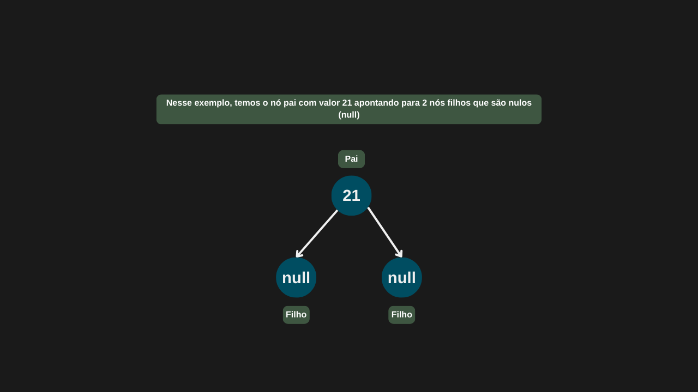
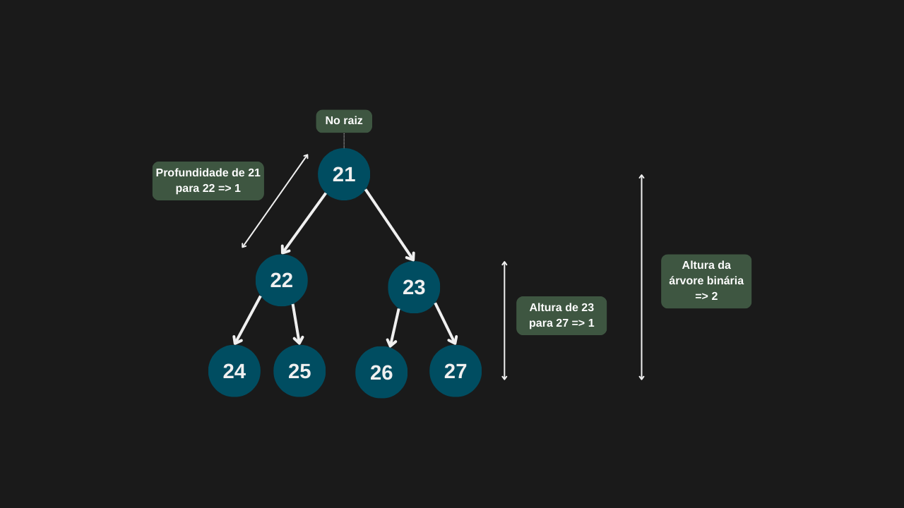
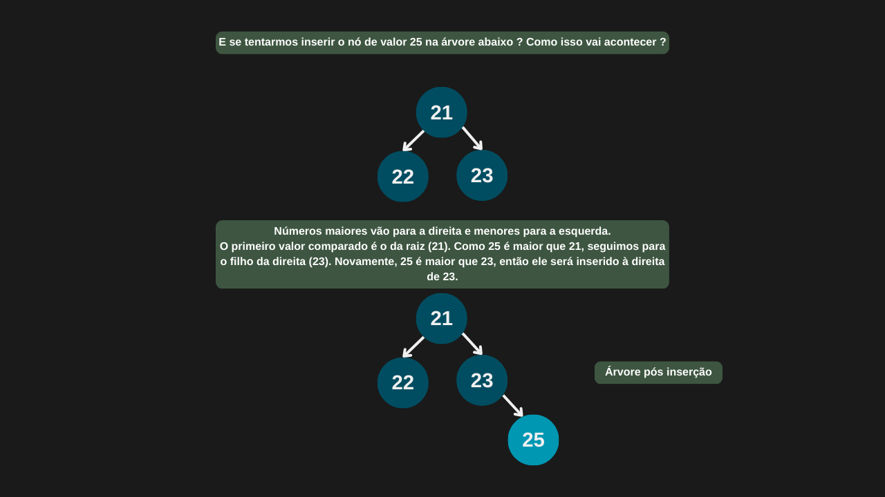

---

comments: true

---

# **Árvores binárias**

Árvores binárias são estruturas de dados não lineares que organizam elementos em uma hierarquia de nós, com relações entre pais e filhos.
Diferente das listas encadeadas, que seguem uma sequência linear, as árvores binárias se ramificam: cada nó contém um valor e até duas referências — uma para o filho à esquerda e outra para o filho à direita. Essa estrutura permite representar decisões, buscas e relações de forma eficiente e organizada, sendo fundamental em diversos algoritmos e aplicações.

```csharp

public class NoArvore (int valor)
{
    public int? Valor = valor;
    public NoArvore? NoEsquerdo;
    public NoArvore? NoDireito;
}

```



Cada nó em uma árvore binária possui até duas referências: uma para o filho esquerdo e outra para o filho direito. O nó no topo da estrutura, que não é filho de nenhum outro, é chamado de nó raiz (root). Os nós conectados à esquerda e à direita de qualquer nó formam o que chamamos de subárvores.

A altura de um nó é a maior distância (em número de arestas) até uma folha em sua subárvore. Ou seja, qualquer nó pode ter uma altura, não apenas a raiz. A altura da árvore, por sua vez, é definida como a altura da raiz.

Já a profundidade de um nó é a distância da raiz até esse nó, e varia conforme a posição do nó na árvore. Esses dois conceitos — altura e profundidade — são fundamentais para entender a estrutura e o desempenho de algoritmos que utilizam árvores.



## **Operações**

Para a realização de operações, vamos começar criando a nossa árvore binária.

```csharp

public class ArvoreBinaria (NoArvore? raiz)
{
    public NoArvore? Raiz = raiz;
}

```

### **Inserção de nós**

Na inserção de nós em uma árvore binária, o primeiro passo é verificar se a árvore está vazia. Se estiver, o novo nó se torna a raiz. Caso contrário, a inserção segue uma estratégia de preenchimento — normalmente adicionando o novo nó na primeira posição disponível, da esquerda para a direita, em ordem de nível. Como se trata de uma árvore binária não ordenada, não é necessário comparar valores nem se preocupar com balanceamento ou ordenação dos nós. O foco é manter a estrutura binária, em que cada nó pode ter no máximo dois filhos.

#### **Complexidade**

Quando a inserção ocorre na raiz ou em um dos filhos imediatos (esquerdo ou direito) e essas posições estão disponíveis, a complexidade é `O(1)`, pois não há necessidade de percorrer a árvore. No entanto, nos demais casos, é necessário percorrer os nós até encontrar uma posição livre, o que resulta em uma complexidade de `O(n)` no pior cenário — especialmente em árvores muito desbalanceadas, como aquelas em que todos os nós estão alinhados à direita, formando uma estrutura semelhante a uma lista ligada.

| Caso         | Complexidade |
|--------------|--------------|
| Melhor caso  | O(1)         |
| Caso médio   | O(n)         |
| Pior caso    | O(n)         |

#### **Implementação**

```csharp

public NoArvore Inserir(int valor)
{
    NoArvore novoNo = new NoArvore(valor);

    if (Raiz is null)
    {
        Raiz = novoNo;
        return Raiz;
    }

    return InserirRecursivamente(Raiz, novoNo);
}

private NoArvore InserirRecursivamente(NoArvore atual, NoArvore novoNo)
{
    if (novoNo.Valor < atual.Valor)
    {
        if (atual.NoEsquerdo is null)
        {
            atual.NoEsquerdo = novoNo;
            return novoNo;
        }

        return InserirRecursivamente(atual.NoEsquerdo, novoNo);
    }

    else
    {
        if (atual.NoDireito is null)
        {
            atual.NoDireito = novoNo;
            return novoNo;
        }

        return InserirRecursivamente(atual.NoDireito, novoNo);

    }
}

```



### **Pesquisa de nós (DFS - Depth-First Search)**

Uma das formas de realizar a busca de um nó em uma árvore é através da Pesquisa em Profundidade (DFS - Depth-First Search). Nessa abordagem, começamos na raiz e exploramos os ramos da árvore de maneira profunda, ou seja, descemos o máximo possível em cada ramo antes de voltar e explorar outros caminhos.

A implementação do DFS pode ser feita de forma recursiva ou iterativa. A lógica básica consiste em:

1. Início da busca: Começamos pela raiz da árvore.

2. Caso base: Se o nó atual for null, significa que o valor procurado não está na árvore, então a busca retorna sem sucesso.

3. Busca bem-sucedida: Se o valor procurado for encontrado no nó atual, retornamos esse nó.

4.  Exploração das subárvores: Se o valor não for encontrado no nó atual, a busca continua explorando as subárvores.Primeiro, explora-se a subárvore à esquerda do nó. Em seguida, explora-se a subárvore à direita.

Esse processo é repetido até que o nó seja encontrado ou todos os nós da árvore tenham sido explorados.

O DFS é eficiente em árvores balanceadas, mas em árvores desbalanceadas, a profundidade pode aumentar, tornando o tempo de busca mais longo.

#### **Complexidade**

Quando o nó procurado é a raiz da árvore, a pesquisa ocorre em tempo constante, com complexidade `O(1)`, já que encontramos o nó imediatamente. No entanto, se o nó não for a raiz, será necessário explorar outros ramos da árvore. O algoritmo pode precisar visitar todos os nós ou seguir o caminho mais profundo possível, explorando as subárvores até encontrar o nó ou até chegar ao final da árvore.

Portanto, em casos em que o nó procurado não é a raiz, a complexidade de tempo será `O(n)`, onde n é o número total de nós na árvore. Isso ocorre porque, no pior cenário, todos os nós precisam ser visitados até encontrar o nó desejado ou determinar que ele não está presente.

| Caso         | Complexidade |
|--------------|--------------|
| Melhor caso  | O(1)         |
| Caso médio   | O(n)         |
| Pior caso    | O(n)         |

#### **Implementação**

```csharp

public NoArvore? Pesquisar(int valor)
    => PesquisarRecursivo(Raiz, valor);        

private NoArvore? PesquisarRecursivo(NoArvore? atual, int valor)
{
    if (atual is null)
        return null;

    if (atual.Valor == valor)
        return atual;

    NoArvore? noPesquisaLadoEsquerdo = PesquisarRecursivo(atual.NoEsquerdo, valor);

    if (noPesquisaLadoEsquerdo is not null)
        return noPesquisaLadoEsquerdo;

    return PesquisarRecursivo(atual.NoDireito, valor);
}

```

### **Remoção de nós**

