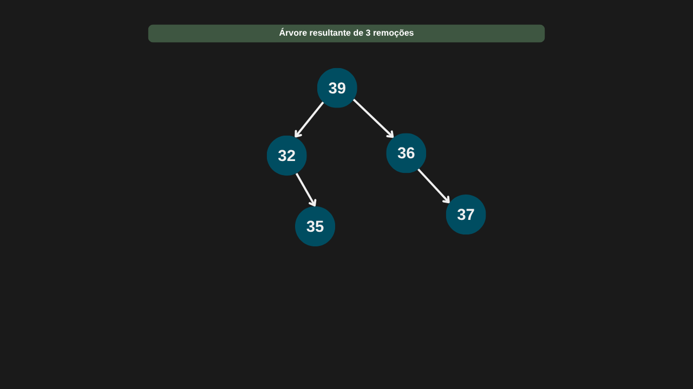

---

comments: true

---

# **Árvores binárias**

Árvores binárias são estruturas de dados não lineares que organizam elementos em uma hierarquia de nós, com relações entre pais e filhos.
Diferente das listas encadeadas, que seguem uma sequência linear, as árvores binárias se ramificam: cada nó contém um valor e até duas referências — uma para o filho à esquerda e outra para o filho à direita. Essa estrutura permite representar decisões, buscas e relações de forma eficiente e organizada, sendo fundamental em diversos algoritmos e aplicações.

```csharp

public class NoArvore (int valor)
{
    public int? Valor = valor;
    public NoArvore? NoEsquerdo;
    public NoArvore? NoDireito;
}

```


Cada nó em uma árvore binária possui até duas referências: uma para o filho esquerdo e outra para o filho direito. O nó no topo da estrutura, que não é filho de nenhum outro, é chamado de nó raiz (root). Os nós conectados à esquerda e à direita de qualquer nó formam o que chamamos de subárvores.

A altura de um nó é a maior distância (em número de arestas) até uma folha em sua subárvore. Ou seja, qualquer nó pode ter uma altura, não apenas a raiz. A altura da árvore, por sua vez, é definida como a altura da raiz.

Já a profundidade de um nó é a distância da raiz até esse nó, e varia conforme a posição do nó na árvore. Esses dois conceitos — altura e profundidade — são fundamentais para entender a estrutura e o desempenho de algoritmos que utilizam árvores.


## **Operações**

Para a realização de operações, vamos começar criando a nossa árvore binária.

```csharp

public class ArvoreBinaria (NoArvore? raiz)
{
    public NoArvore? Raiz = raiz;
}

```

### **Inserção de nós**

Na inserção de nós em uma árvore binária, o primeiro passo é verificar se a árvore está vazia. Se estiver, o novo nó se torna a raiz. Caso contrário, a inserção segue uma estratégia de preenchimento — normalmente adicionando o novo nó na primeira posição disponível, da esquerda para a direita, em ordem de nível. Como se trata de uma árvore binária não ordenada, não é necessário comparar valores nem se preocupar com balanceamento ou ordenação dos nós. O foco é manter a estrutura binária, em que cada nó pode ter no máximo dois filhos.

#### **Complexidade**

Quando a inserção ocorre na raiz ou em um dos filhos imediatos (esquerdo ou direito) e essas posições estão disponíveis, a complexidade é `O(1)`, pois não há necessidade de percorrer a árvore. No entanto, nos demais casos, é necessário percorrer os nós até encontrar uma posição livre, o que resulta em uma complexidade de `O(n)` no pior cenário — especialmente em árvores muito desbalanceadas, como aquelas em que todos os nós estão alinhados à direita, formando uma estrutura semelhante a uma lista ligada.

| Caso         | Complexidade |
|--------------|--------------|
| Melhor caso  | O(1)         |
| Caso médio   | O(n)         |
| Pior caso    | O(n)         |

#### **Implementação**

```csharp

public NoArvore Inserir(int valor)
{
    NoArvore novoNo = new NoArvore(valor);

    if (Raiz is null)
    {
        Raiz = novoNo;
        return Raiz;
    }

    return InserirRecursivamente(Raiz, novoNo);
}

private NoArvore InserirRecursivamente(NoArvore atual, NoArvore novoNo)
{
    if (novoNo.Valor < atual.Valor)
    {
        if (atual.NoEsquerdo is null)
        {
            atual.NoEsquerdo = novoNo;
            return novoNo;
        }

        return InserirRecursivamente(atual.NoEsquerdo, novoNo);
    }

    else
    {
        if (atual.NoDireito is null)
        {
            atual.NoDireito = novoNo;
            return novoNo;
        }

        return InserirRecursivamente(atual.NoDireito, novoNo);

    }
}

```


### **Pesquisa de nós em profundidade (DFS - Depth-First Search)**

Uma forma comum de buscar um nó em uma árvore é usando a Pesquisa em Profundidade (DFS – Depth-First Search). Nessa abordagem, começamos pela raiz e exploramos o máximo possível cada ramo da árvore antes de voltar e tentar outros caminhos.

A DFS pode ser implementada de forma recursiva ou iterativa (usando uma pilha). A lógica básica da busca é:

1. Início da busca: Começamos pela raiz da árvore.

2. Caso base: Se o nó atual for null, significa que o valor não está na árvore.

3. Valor encontrado: Se o valor do nó atual for o procurado, retornamos esse nó.

4. Exploração: Se não for o valor, continuamos a busca nas subárvores – primeiro à esquerda, depois à direita.

Esse processo se repete até encontrar o valor ou percorrer todos os nós da árvore.

Embora eficiente em árvores balanceadas, a DFS pode ser menos eficiente em árvores desbalanceadas, já que a profundidade aumenta e o tempo de busca pode crescer.

#### **Ordens de visita na DFS**

A DFS pode ser feita em três ordens diferentes, dependendo da posição da raiz em relação aos filhos:

1. Pré-Ordem (PreOrder): Visita primeiro a raiz, depois o filho esquerdo e o filho direito.

2. Em Ordem (InOrder): Visita primeiro o filho esquerdo, depois a raiz e, por fim, o filho direito.

3. Pós-Ordem (PostOrder): Visita primeiro os filhos (esquerdo e direito) e só depois a raiz.

#### **Complexidade**

Quando o nó procurado é a raiz da árvore, a pesquisa ocorre em tempo constante, com complexidade `O(1)`, já que encontramos o nó imediatamente. No entanto, se o nó não for a raiz, será necessário explorar outros ramos da árvore. O algoritmo pode precisar visitar todos os nós ou seguir o caminho mais profundo possível, explorando as subárvores até encontrar o nó ou até chegar ao final da árvore.

Portanto, em casos em que o nó procurado não é a raiz, a complexidade de tempo será `O(n)`, onde n é o número total de nós na árvore. Isso ocorre porque, no pior cenário, todos os nós precisam ser visitados até encontrar o nó desejado ou determinar que ele não está presente.

| Caso         | Complexidade |
|--------------|--------------|
| Melhor caso  | O(1)         |
| Caso médio   | O(n)         |
| Pior caso    | O(n)         |

#### **Implementação**

=== "DFS Pré-Ordem"

    ```csharp

    public NoArvore? PesquisarComDfsPreOrdem(int valor)
    {
        if (Raiz is null)
            return null;

        Stack<NoArvore> pilha = new();
        pilha.Push(Raiz);

        while (pilha.Count > 0)
        {
            NoArvore noAtual = pilha.Pop();

            if (noAtual.Valor == valor)
                return noAtual;
                            
            if (noAtual.NoDireito is not null)
                pilha.Push(noAtual.NoDireito);

            if (noAtual.NoEsquerdo is not null)
                pilha.Push(noAtual.NoEsquerdo);
        }

        return null;
    }        

    ```

=== "DFS Em Ordem"

    ```csharp

    public NoArvore? PesquisarDfsEmOrdem(int valor)
    => PesquisarDfsEmOrdemRecursivo(Raiz, valor);

    private NoArvore? PesquisarDfsEmOrdemRecursivo(NoArvore? noAtual, int valor)
    {
        if (noAtual is null)
            return null;

        // Busca na subárvore esquerda
        NoArvore? noEsquerdo = PesquisarDfsEmOrdemRecursivo(noAtual.NoEsquerdo, valor);
        if (noEsquerdo is not null)
            return noEsquerdo;

        // Verifica o nó atual
        if (noAtual.Valor == valor)
            return noAtual;

        // Busca na subárvore direita
        return PesquisarDfsEmOrdemRecursivo(noAtual.NoDireito, valor);
    }

    ```

=== "DFS Pós-Ordem"

    ```csharp

    public NoArvore? PesquisarDfsPosOrdem(int valor)
    => PesquisarDfsPosOrdemRecursivo(Raiz, valor);

    private NoArvore? PesquisarDfsPosOrdemRecursivo(NoArvore? noAtual, int valor)
    {
        if (noAtual is null)
            return null;

        // Busca na subárvore esquerda
        NoArvore? noEsquerdo = PesquisarDfsPosOrdemRecursivo(noAtual.NoEsquerdo, valor);
        if (noEsquerdo is not null)
            return noEsquerdo;

        // Busca na subárvore direita
        NoArvore? noDireito = PesquisarDfsPosOrdemRecursivo(noAtual.NoDireito, valor);
        if (noDireito is not null)
            return noDireito;

        // Verifica o nó atual
        if (noAtual.Valor == valor)
            return noAtual;

        return null;
    }

    ```
<!-- -->

=== "DFS Pré-Ordem"

    

=== "DFS Em Ordem"

    

=== "DFS Pós-Ordem"

    


### **Pesquisa de nós em largura (Breadth-First Search)**

Outra forma de pesquisar por nós é usando a pesquisa em largura. Ela consiste em visitar os nós da árvore nível por nível. A pesquisa começa pela raiz da árvore, visita todos os vizinhos (filhos diretos) antes de descer para o nível abaixo e para manter a ordem de visitação, usamos uma fila ou recursão.

#### **Complexidade**

Se o nó procurado for a raiz, então a complexidade é `O(1)`. Caso contrário, será necessário visitar os nós até achar o nó procurado. Nesse caso, a complexidade é `O(n)`.

| Caso         | Complexidade |
|--------------|--------------|
| Melhor caso  | O(1)         |
| Caso médio   | O(n)         |
| Pior caso    | O(n)         |

#### **Implementação**

```csharp

public NoArvore? PesquisarComBfs(int valor)
{
    if (Raiz is null) 
        return null;

    Queue<NoArvore> nosVisitados = new();
    nosVisitados.Enqueue(Raiz);

    while (nosVisitados.Count > 0)
    {
        NoArvore noAtual = nosVisitados.Dequeue();

        if (noAtual.Valor == valor)
            return noAtual;

        if (noAtual.NoEsquerdo is not null)
            nosVisitados.Enqueue(noAtual.NoEsquerdo);

        if (noAtual.NoDireito is not null)
            nosVisitados.Enqueue(noAtual.NoDireito);
    }

    return null;
}

```


### **Remoção de nós**

A remoção de um nó em uma árvore binária de busca envolve 3 casos principais:

1. Nó sem filhos (nó folha)
O nó é removido e simplesmente a referência para ele se torna `null`.

2. Nó com um filho (esquerdo ou direito)
O nó é removido e o filho (caso exista) ocupa o lugar dele, ou seja, a referência ao nó é substituída pela referência ao filho.

3. Nó com dois filhos
O nó é removido, mas como ele tem dois filhos, precisamos encontrar uma forma de mantê-lo na estrutura da árvore. O método utilizado aqui é substituir o nó pelo seu sucessor, ou seja, o nó de menor valor na subárvore à direita do nó a ser removido.

#### **Complexidade**

Em uma árvore balanceada, o tempo necessário para percorrer até o nó desejado é proporcional à altura da árvore. Portanto, a operação de remoção, que envolve procurar o nó e, em alguns casos, encontrar o sucessor e removê-lo, leva `O(log n)` tempo.

No pior caso, a árvore pode se tornar uma lista encadeada (se os elementos forem inseridos em ordem crescente ou decrescente, por exemplo). Nesse caso, a operação de remoção teria uma complexidade de `O(n)`.

| Caso         | Complexidade |
|--------------|--------------|
| Melhor caso  | O(log n)     |
| Caso médio   | O(log n)     |
| Pior caso    | O(n)         |

#### **Implementação**

```csharp

public void Remover(int valor)
    => Raiz = RemoverRecursivo(Raiz, valor);

private NoArvore? RemoverRecursivo(NoArvore? noAtual, int valor)
{
    if (noAtual is null)
        return null;

    if (valor < noAtual.Valor)
        noAtual.NoEsquerdo = RemoverRecursivo(noAtual.NoEsquerdo, valor);
    
    else if (valor > noAtual.Valor)
        noAtual.NoDireito = RemoverRecursivo(noAtual.NoDireito, valor);
    
    else
    {
        // Caso 1: Sem filhos
        if (noAtual.NoEsquerdo is null && noAtual.NoDireito is null)
            return null;

        // Caso 2: Um filho
        if (noAtual.NoEsquerdo is null)
            return noAtual.NoDireito;

        if (noAtual.NoDireito is null)
            return noAtual.NoEsquerdo;

        // Caso 3: Dois filhos
        NoArvore noSucessor = EncontrarMinimo(noAtual.NoDireito);
        noAtual.Valor = noSucessor.Valor;
        noAtual.NoDireito = RemoverRecursivo(noAtual.NoDireito, noSucessor.Valor.Value);
    }

    return noAtual;
}

private NoArvore EncontrarMinimo(NoArvore? noAtual)
{
    while (noAtual?.NoEsquerdo is not null)
        noAtual = noAtual.NoEsquerdo;

    return noAtual;
}

```

=== "Árvore inicial"

    

=== "Remoção - Caso 01 - Nó sem filhos"

    

=== "Remoção - Caso 02 - Nó com 1 filho"

    

=== "Remoção - Caso 03 - Nó com filhos"

    

=== "Árvore resultante das 3 remoções"

    