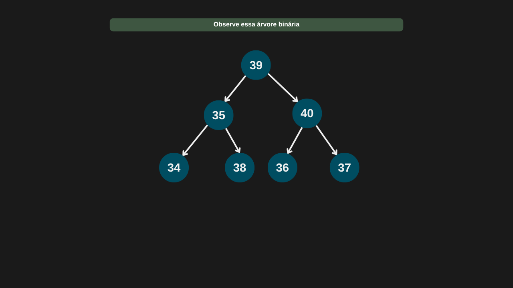

---

comments: true

---

# **Árvore de pesquisa binária (BST - Binary Search Tree)**

A árvore de pesquisa binária é um tipo específico de árvore binária que organiza seus elementos de forma ordenada, permitindo operações eficientes de busca, inserção e remoção.

Sua estrutura é hierárquica e recursiva, e segue uma regra fundamental de ordenação:

- Para cada nó, todos os elementos da subárvore à esquerda devem ter valores menores que o valor do nó.

- Todos os elementos da subárvore à direita devem ter valores maiores.

Essa propriedade deve ser mantida recursivamente em toda a árvore.

Além disso:

- Cada valor armazenado é único (a BST tradicional não permite duplicações).

- A estrutura inicial de uma árvore de pesquisa binária é igual à de uma árvore binária comum — o que muda são as regras para inserção, busca e remoção de nós, que devem sempre respeitar a ordenação binária.

```csharp

public class NoArvore (int valor)
{
    public int? Valor = valor;
    public NoArvore? NoEsquerdo;
    public NoArvore? NoDireito;
}

```

```csharp

public class ArvorePesquisaBinaria (NoArvore? noArvore)
{
    public NoArvore Raiz = noArvore;   
}

```


## **Operações**

Vamos usar a árvore de pesquisa binária criada recentemente para realizar as operações.

### **Inserção de nós**

A inserção de um novo nó em uma árvore de pesquisa binária segue uma lógica baseada em comparações:

1. Comparação com o nó atual: começando pela raiz, compara-se o valor a ser inserido com o valor do nó atual:

- Se o valor for menor, a busca continua na subárvore esquerda.

- Se for maior, segue-se para a subárvore direita.

- Esse processo se repete recursivamente até encontrar uma posição vazia (um ponteiro `null`).

2. Evita duplicações: caso o valor a ser inserido já exista na árvore, ele não será inserido, preservando a propriedade de que todos os valores na árvore são únicos.

#### **Complexidade**

Para inserir um novo nó em uma árvore de pesquisa binária, é necessário percorrer a árvore desde a raiz até encontrar a posição correta. Esse caminho depende da altura da árvore.

Quando a árvore está relativamente balanceada, o número de comparações necessárias para encontrar a posição de inserção cresce de forma logarítmica em relação ao número de nós. Isso significa que, em média, a inserção ocorre em tempo `O(log n)`.

Se a árvore estiver desbalanceada, como quando os elementos são inseridos em ordem crescente ou decrescente, ela se degenera em uma lista encadeada. Nessa situação, é preciso percorrer todos os nós para inserir o novo valor, resultando em uma complexidade `O(n)`.

| Caso         | Complexidade |
|--------------|--------------|
| Melhor caso  | O(1)         |
| Caso médio   | O(log n)     |
| Pior caso    | O(n)         |

#### **Implementação**

```csharp

public NoArvore Inserir(int valor)
    => InserirRecursivo(Raiz, valor);

private NoArvore InserirRecursivo(NoArvore noAtual, int valor)
{
    if (valor < noAtual.Valor)
    {
        if (noAtual.NoEsquerdo is null)
        {
            noAtual.NoEsquerdo = new(valor);
            return noAtual.NoEsquerdo;
        }
        else
            return InserirRecursivo(noAtual.NoEsquerdo, valor);
        
    }
    else if (valor > noAtual.Valor)
    {
        if (noAtual.NoDireito == null)
        {
            noAtual.NoDireito = new NoArvore(valor);
            return noAtual.NoDireito;
        }
        else
            return InserirRecursivo(noAtual.NoDireito, valor);
        
    }

    // Se valor já existir, não insere
    return null;
}

```


### **Pesquisa binária na Árvore de Pesquisa Binária**

Embora seja possível realizar pesquisas em largura (BFS) e em profundidade (DFS) em uma árvore binária de pesquisa, esse tipo de estrutura possui um método próprio e mais eficiente para localizar elementos: a pesquisa binária. Essa pesquisa aproveita a ordenação dos nós para descartar metade da árvore a cada comparação, tornando o processo muito mais rápido. Esse comportamento segue o paradigma de divisão e conquista, onde o problema é reduzido progressivamente até que a solução seja encontrada ou determinada como inexistente.

#### **Complexidade**

Se o nó pesquisado for a raiz da árvore, a pesquisa é imediata, resultando em uma complexidade de `O(1)`. No caso médio, é necessário percorrer parte da árvore. Como a pesquisa binária segue o paradigma de divisão e conquista, a cada passo descartamos uma subárvore inteira, o que leva a uma complexidade de `O(log n)` em árvores balanceadas. No entanto, no pior caso — quando a árvore está completamente desbalanceada, assumindo a forma de uma lista encadeada — a pesquisa percorre todos os nós, resultando em uma complexidade de `O(n)`.

#### **Implementação**

```csharp

public NoArvore? Pesquisar(int valor)
    => PesquisarRecursivo(Raiz, valor);

private NoArvore? PesquisarRecursivo(NoArvore? noAtual, int valor)
{
    if (noAtual == null)
        return null;

    if (valor == noAtual.Valor)
        return noAtual;

    if (valor < noAtual.Valor)
        return PesquisarRecursivo(noAtual.NoEsquerdo, valor);

    return PesquisarRecursivo(noAtual.NoDireito, valor);
}

```


### **Remoção de nós**

Ao remover um nó em uma árvore binária de pesquisa, é necessário ter atenção especial para manter a ordem da estrutura, ou seja, a propriedade que define que os valores à esquerda são menores e os à direita são maiores que o nó atual.

A remoção pode se enquadrar em três casos principais:

1. Nó folha (sem filhos). O nó pode ser simplesmente removido da árvore, pois não afeta nenhuma outra estrutura.

2. Nó com um único filho (esquerdo ou direito). Substituímos o nó a ser removido pelo seu único filho, mantendo a estrutura da árvore intacta.

3. Nó com dois filhos. Nesse caso, substituímos o valor do nó pelo menor valor da subárvore direita (ou, alternativamente, pelo maior valor da subárvore esquerda). Em seguida, removemos recursivamente o nó que forneceu esse valor substituto. Essa abordagem garante que a árvore continue ordenada corretamente.

#### **Complexidade**

Se o nó a ser removido for a raiz da árvore, a remoção pode ser feita imediatamente, representando um caso de complexidade `O(1)`.
Em situações típicas (caso médio), é necessário percorrer parte da estrutura até localizar o nó alvo, o que resulta em uma complexidade de `O(log n)` em árvores balanceadas.
Porém, no pior cenário — quando a árvore está totalmente desbalanceada, assumindo a forma de uma lista encadeada — será necessário percorrer todos os nós, elevando a complexidade para `O(n)`.

| Caso         | Complexidade |
|--------------|--------------|
| Melhor caso  | O(1)         |
| Caso médio   | O(log n)     |
| Pior caso    | O(n)         |

#### **Implementação**

```csharp

public void Remover(int valor)
    => Raiz = RemoverRecursivo(Raiz, valor);

private NoArvore? RemoverRecursivo(NoArvore? noAtual, int valor)
{
    if (noAtual is null)
        return null;

    if (valor < noAtual.Valor)            
        noAtual.NoEsquerdo = RemoverRecursivo(noAtual.NoEsquerdo, valor);
    
    else if (valor > noAtual.Valor)            
        noAtual.NoDireito = RemoverRecursivo(noAtual.NoDireito, valor);
    
    else
    {
        // Caso 1: nó folha
        if (noAtual.NoEsquerdo is null && noAtual.NoDireito is null)
            return null;

        // Caso 2: um filho
        if (noAtual.NoEsquerdo is null)
            return noAtual.NoDireito;

        if (noAtual.NoDireito is null)
            return noAtual.NoEsquerdo;

        // Caso 3: dois filhos
        NoArvore sucessor = EncontrarMinimo(noAtual.NoDireito);
        noAtual.Valor = sucessor.Valor;
        noAtual.NoDireito = RemoverRecursivo(noAtual.NoDireito, sucessor.Valor.Value);
    }

    return noAtual;
}

private NoArvore EncontrarMinimo(NoArvore noAtual)
{
    while (noAtual.NoEsquerdo is not null)            
        noAtual = noAtual.NoEsquerdo;
    
    return noAtual;
}

```

=== "Árvore de pesquisa binária inicial"

    

=== "Remoção - Caso 01 - Nó sem filhos"

    

=== "Remoção - Caso 02 - Nó com 1 filho"

    

=== "Remoção - Caso 03 - Nó com filhos"

    

=== "Árvore resultante das 3 remoções"

    