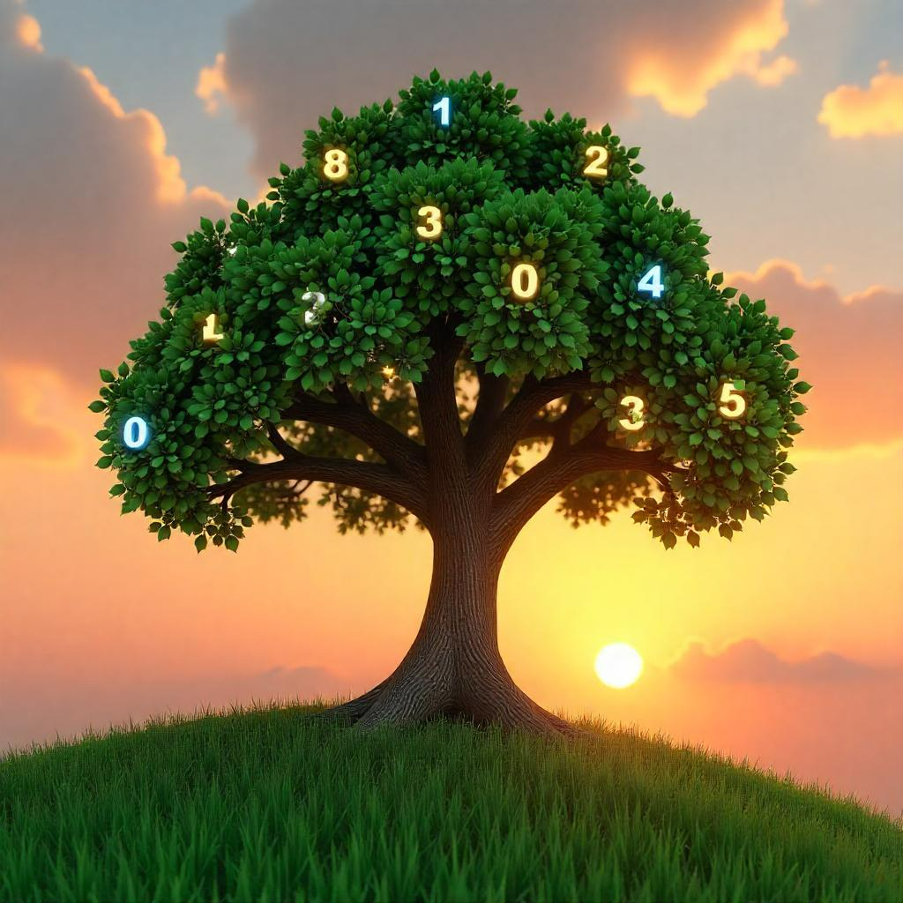

---

comments: true

---

# **Introdução à arvores**

Em mais um dia corrido, Gisele está planejando como organizar suas atividades. Para ir à academia, que fica a certa distância de sua casa, ela precisa primeiro buscar seu carro na oficina mecânica.

Como alternativa à academia, Gisele considerou se exercitar ao ar livre. No entanto, para isso, ela precisa comprar um tênis novo. Para fazer essa compra, o primeiro passo é decidir qual meio de transporte utilizar. Em seguida, precisa verificar se o seu cartão possui saldo suficiente. Caso contrário, será necessário pagar a fatura antes de prosseguir.

Sabe o que o planejamento da Gisele tem a ver com árvores binárias? Tudo!
Cada tarefa que ela precisa realizar pode ser vista como um nó em uma árvore. Para acessar novas atividades, ela precisa antes concluir as anteriores — exatamente como ao percorrer uma árvore, em que é necessário passar por nós intermediários para chegar aos próximos.

Ela tem dois caminhos possíveis: ir à academia ou se exercitar ao ar livre — como em uma árvore binária, onde cada nó pode levar a duas novas decisões. À medida que Gisele avança, novas tarefas são adicionadas como novos ramos em sua árvore de planejamento, formando uma estrutura lógica e encadeada que organiza seu dia.

Vamos adentrar o fascinante mundo das árvores binárias.

[8.1 Árvores binárias](../arvores/arvores-binarias.md)