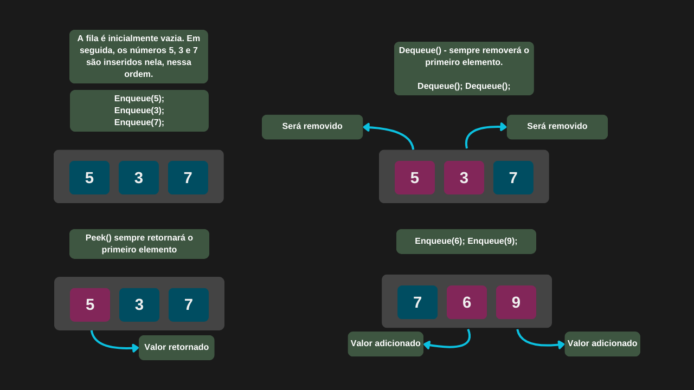

---

comments: true

---

# **Implementação padrão de filas usando C#**

A linguagem C# já fornece uma estrutura de fila pronta por meio da classe `Queue<T>`, disponível em `System.Collections.Generic`. As principais operações são: `Enqueue` para inserir elementos, `Dequeue` para remover o topo e `Peek` para visualizar o topo sem removê-lo. Para verificar o tamanho da pilha ou saber se ela está vazia, utilizamos a propriedade `Count`.

## **Implementação**

```csharp

public class FilaPadrao
{
    private Queue<int> Itens;

    public FilaPadrao()
        => Itens = new Queue<int>();

    public void Enqueue(int item)
        => Itens.Enqueue(item);

    public int Dequeue()
        => Itens.Dequeue();

    public int Peek()
        => Itens.Peek();

    public bool IsEmpty() => Itens.Count == 0;

    public int Size() => Itens.Count;
}

```

=== "Operações em uma fila"

    