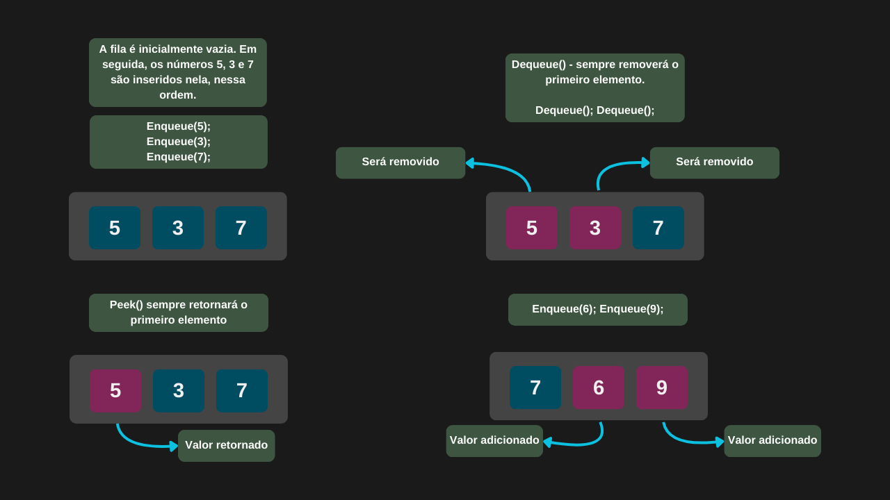

---

comments: true

---

# **Filas e suas operações**

Filas são estruturas de dados do tipo `FIFO (First In, First Out)`, em que o primeiro elemento inserido é o primeiro a ser removido. Assim como em uma fila de atendimento, apenas o elemento na frente está disponível para acesso imediato. Suas operações principais incluem: `Enqueue`, para adicionar um elemento ao final; `Dequeue`, para remover e retornar o primeiro elemento; `Peek` ou `Front`, para visualizar o primeiro elemento sem removê-lo; `IsEmpty`, para verificar se a fila está vazia; e `Size`, que retorna a quantidade de elementos na fila.

## **Inserção de dados (Enqueue)**

A inserção de elementos em uma fila ocorre sempre ao final da estrutura, de forma direta, sem a necessidade de percorrê-la. Por isso, essa operação possui complexidade de tempo constante, ou seja, `O(1)`.

| Caso         | Complexidade |
|--------------|--------------|
| Melhor caso  | O(1)         |
| Caso médio   | O(1)         |
| Pior caso    | O(1)         |

## **Remoção de dados (Dequeue)**

A remoção de elementos em uma fila ocorre sempre no início da estrutura, de forma direta e sem a necessidade de percorrer os dados. Por isso, essa operação também possui complexidade constante, ou seja, `O(1)`.

| Caso         | Complexidade |
|--------------|--------------|
| Melhor caso  | O(1)         |
| Caso médio   | O(1)         |
| Pior caso    | O(1)         |

## **Pegando dados (Peek)**

Qualquer tentativa de acesso a um elemento em uma fila sempre retornará o primeiro item, sem a necessidade de percorrer a estrutura. Por esse motivo, a operação também apresenta complexidade constante, ou seja, `O(1)`.

| Caso         | Complexidade |
|--------------|--------------|
| Melhor caso  | O(1)         |
| Caso médio   | O(1)         |
| Pior caso    | O(1)         |

## **Verificando se a fila está vazia (IsEmpty)**

Nesse caso, o que ocorre é apenas a verificação da existência de um elemento na primeira posição da fila, uma operação simples e direta, que também possui complexidade constante, ou seja, `O(1)`.

| Caso         | Complexidade |
|--------------|--------------|
| Melhor caso  | O(1)         |
| Caso médio   | O(1)         |
| Pior caso    | O(1)         |

## **Verificando o tamanho da fila (Size)**

Ao manter um contador atualizado na estrutura da fila, é possível obter seu tamanho diretamente, sem percorrer os elementos. Dessa forma, a complexidade da operação permanece constante, ou seja, `O(1)`.

| Caso         | Complexidade |
|--------------|--------------|
| Melhor caso  | O(1)         |
| Caso médio   | O(1)         |
| Pior caso    | O(1)         |

!!! tip "Uso no dia-a-dia"

    A estrutura de fila é amplamente utilizada em cenários como o gerenciamento de tarefas, sistemas de atendimento, envio de mensagens em chats e outros contextos onde é necessário processar elementos na ordem em que são recebidos.

## **Implementação**

```csharp

public class Fila
{
    private int[] Itens;
    private int Inicio;
    private int Fim;
    private int Tamanho;
    private const int Capacidade = 10;

    public Fila()
    {
        Itens = new int[Capacidade];
        Inicio = 0;
        Fim = 0;
        Tamanho = 0;
    }

    public void Enqueue(int item)
    {
        if (Tamanho == Capacidade)
            throw new InvalidOperationException("Fila cheia.");

        Itens[Fim] = item;
        Fim = Fim + 1;
        Tamanho = Tamanho + 1;
    }

    public int Dequeue()
    {
        if (IsEmpty())
            throw new InvalidOperationException("Fila vazia.");

        int item = Itens[Inicio];
        Inicio = Inicio + 1;
        Tamanho = Tamanho - 1;
        return item;
    }

    public int Peek()
    {
        if (IsEmpty())
            throw new InvalidOperationException("Fila vazia.");

        return Itens[Inicio];
    }

    public bool IsEmpty() => Tamanho == 0;

    public int Size() => Tamanho;
}

```

=== "Operações em uma fila"

    