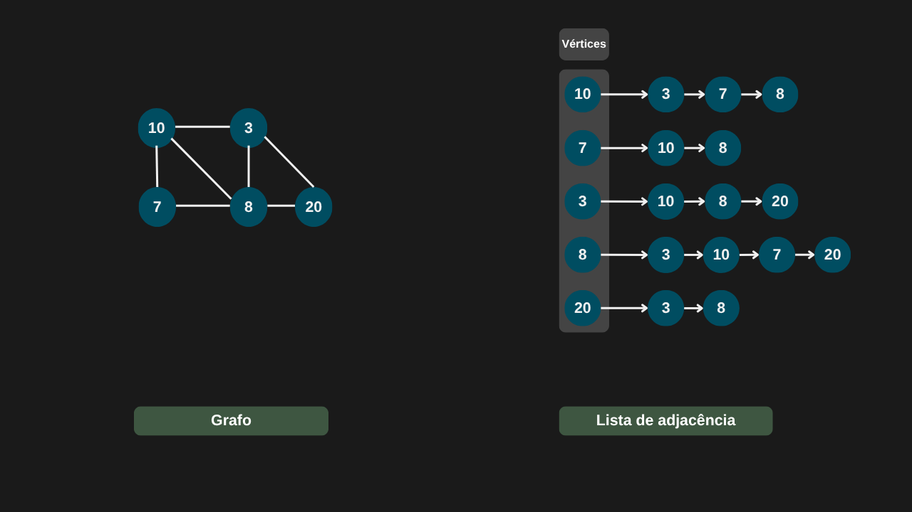
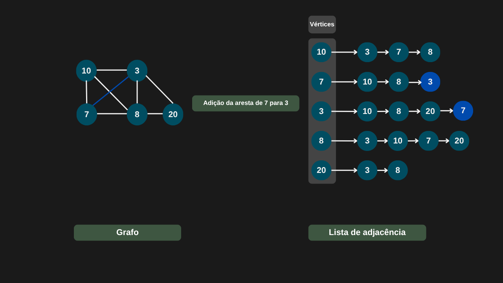
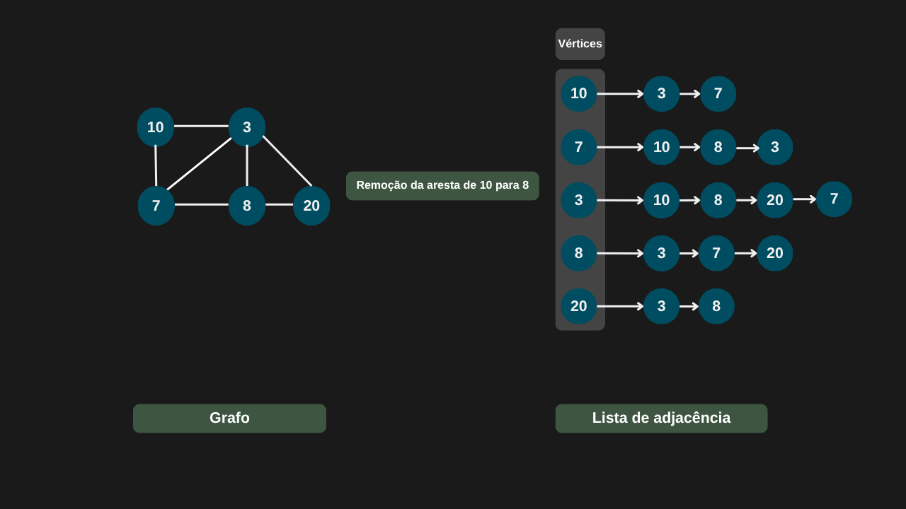
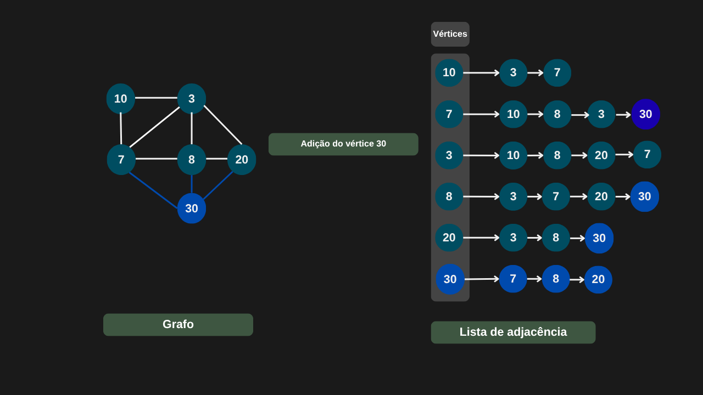
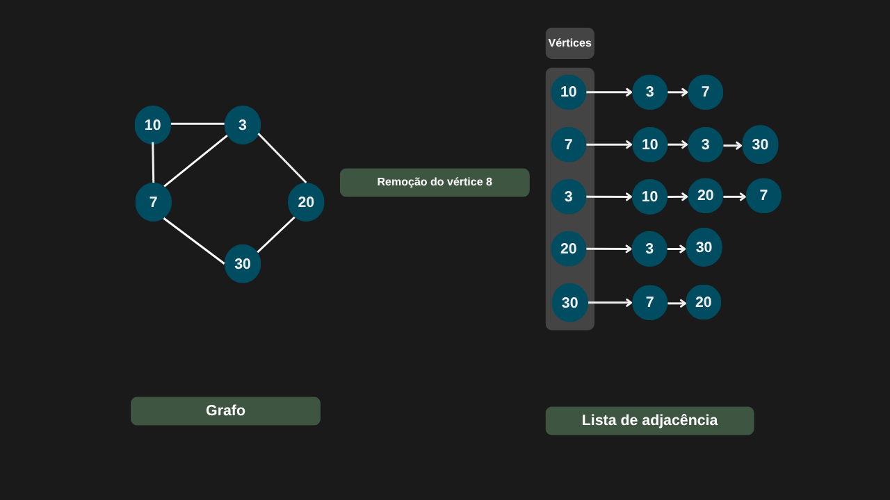
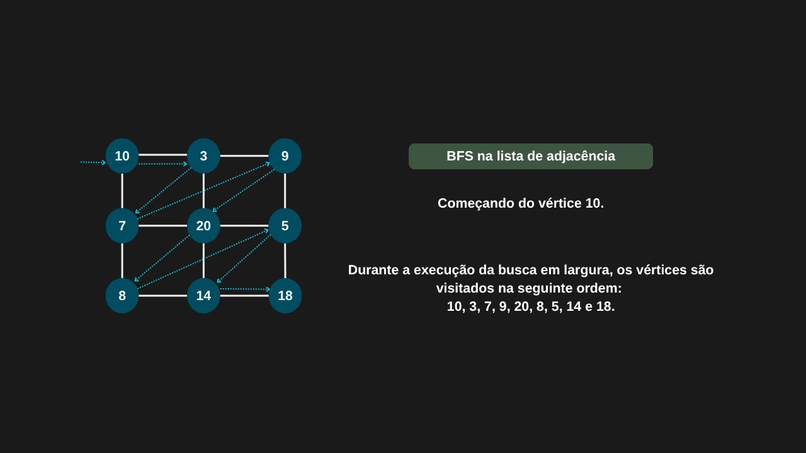
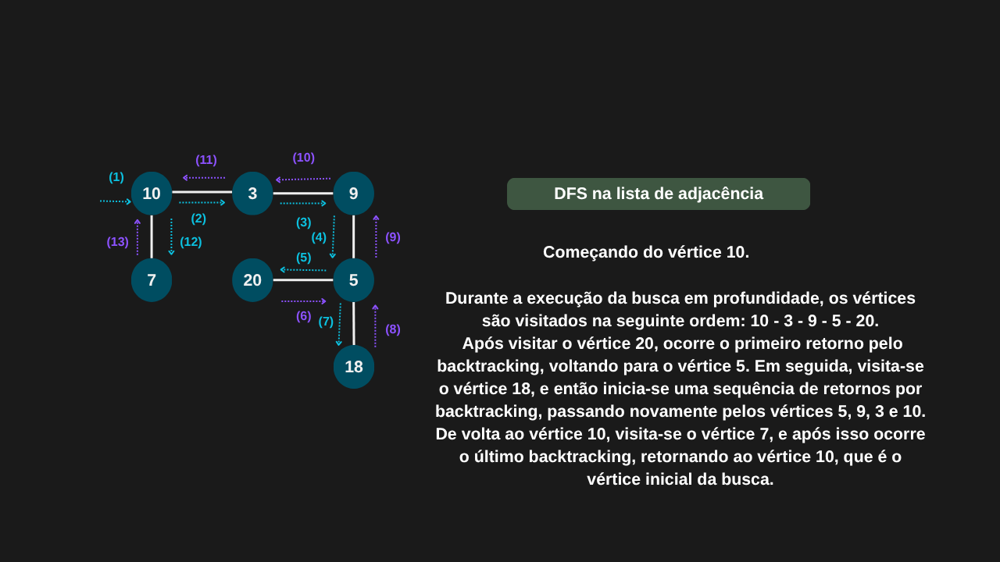

---

comments: true

---

# **Operações básicas em grafos**

As operações em grafos podem ser classificadas em dois tipos principais: aquelas que envolvem vértices e aquelas que envolvem arestas. A forma de implementá-las varia de acordo com a representação escolhida — seja por matriz de adjacência ou por lista de adjacência.

## **Operações usando matriz de adjacência**

Usando um grafo não direcionado como exemplo, podemos considerar as seguintes operações na representação por matriz de adjacência:

- Adição ou remoção de arestas: a modificação é feita diretamente na matriz, acessando a posição correspondente em tempo `O(1)`. No caso de grafos não direcionados, é necessário atualizar as duas posições simétricas da matriz.

- Adição de vértices: requer adicionar uma nova linha e uma nova coluna à matriz, inicializando seus valores com 0. Essa operação tem complexidade `O(n)`.

- Remoção de vértices: envolve a exclusão da linha e da coluna correspondentes ao vértice. No pior caso (remoção da primeira linha e coluna), é preciso deslocar `(n − 1)²` elementos, resultando em complexidade `O(n²)`.

- Inicialização: para criar a matriz de adjacência, é necessário inicializar `n × n` posições com valor 0, o que possui complexidade `O(n²)`.

=== "Inicializando a matriz de adjacência"

    

=== "Adição de arestas"

    

=== "Exclusão de arestas"

    

=== "Adição de vértices"

    

=== "Exclusão de vértices"

    

## **Implementação**

Agora vamos implementar a matriz de adjacência do nosso grafo, considerando que ele pode ser direcionado ou não.

```csharp

public class GrafoMatrizAdjacencia
{
    private int[,] matrizAdjacencia;
    private int quantidadeVertices;
    private bool grafoDirecionado;

    public GrafoMatrizAdjacencia(int numVertices, bool direcionado = false)
    {
        if (numVertices <= 0)
            throw new ArgumentException("Número de vértices deve ser maior que zero.", nameof(numVertices));

        quantidadeVertices = numVertices;
        matrizAdjacencia = new int[numVertices, numVertices];
        grafoDirecionado = direcionado;
    }

    public bool AdicionarAresta(int origem, int destino, int peso = 1)
    {
        if (!VerticesSaoValidos(origem, destino))
            return false;

        matrizAdjacencia[origem, destino] = peso;

        if (!grafoDirecionado)
            matrizAdjacencia[destino, origem] = peso;

        return true;
    }

    public bool RemoverAresta(int origem, int destino)
    {
        if (!VerticesSaoValidos(origem, destino))
            return false;

        matrizAdjacencia[origem, destino] = 0;

        if (!grafoDirecionado)
            matrizAdjacencia[destino, origem] = 0;

        return true;
    }

    public bool ExisteAresta(int origem, int destino)
        => VerticesSaoValidos(origem, destino) && matrizAdjacencia[origem, destino] != 0;

    private bool VerticesSaoValidos(int origem, int destino)
        => origem >= 0 && origem < quantidadeVertices &&
        destino >= 0 && destino < quantidadeVertices;
}

```

!!! tip "Grafo não direcionado"
    Em um grafo não direcionado, a aresta possui o mesmo peso em ambas as direções. Por isso, usamos um `if` para garantir que a matriz seja atualizada em ambos os sentidos.


## **Operações usando lista de adjacência**

Usando um grafo não direcionado com `n` vértices e `m` arestas como exemplo, podemos analisar as principais operações em uma lista de adjacência:

- Adição de arestas: insere-se a aresta ao final da lista encadeada correspondente ao vértice, com tempo de execução `O(1)`. Em um grafo direcionado, a inserção ocorre apenas em uma direção; já em um grafo não direcionado, é necessário adicionar a aresta em ambas as direções.

- Remoção de arestas: consiste em localizar e excluir a aresta dentro da lista encadeada de um vértice, com tempo `O(n)` no pior caso. Em grafos não direcionados, a remoção deve ser feita em ambas as listas envolvidas.

- Adição de vértices: adiciona-se uma nova lista encadeada à lista de adjacência, representando o novo vértice, com tempo `O(1)`.

- Remoção de vértices: é necessário percorrer toda a estrutura para remover o vértice e todas as arestas associadas a ele, resultando em tempo `O(n + m)`.

- Inicialização: envolve a criação dos `n` vértices e das `m` arestas, com tempo total `O(n + m)`.

=== "Inicializando a lista de adjacência"

    

=== "Adição de arestas"

    

=== "Exclusão de arestas"

    

=== "Adição de vértices"

    

=== "Exclusão de vértices"

    

## **Implementação**

Agora vamos implementar a lista de adjacência do nosso grafo, considerando que ele pode ser direcionado ou não.

```csharp

public class GrafoListaAdjacencia
{
    private Dictionary<int, List<int>> verticesAdjacentes;
    private bool grafoDirecionado;

    public int NumeroDeVertices => verticesAdjacentes.Count;

    public GrafoListaAdjacencia(bool direcionado = false)
    {
        verticesAdjacentes = new Dictionary<int, List<int>>();
        grafoDirecionado = direcionado;
    }

    public bool AdicionarVertice(int vertice)
    {
        bool verticeFoiAdicionado = false;

        if (verticesAdjacentes.ContainsKey(vertice))
            return false;

        verticesAdjacentes[vertice] = new List<int>();

        verticeFoiAdicionado = true;
        return verticeFoiAdicionado;
    }

    public bool RemoverVertice(int vertice)
    {
        bool verticeFoiRemovido = false;

        if (!verticesAdjacentes.TryGetValue(vertice, out _))
            return verticeFoiRemovido;

        verticesAdjacentes.Remove(vertice);

        foreach (List<int> valoresAdjacencia in verticesAdjacentes.Values)
            valoresAdjacencia.Remove(vertice);

        verticeFoiRemovido = true;
        return true;
    }

    public bool AdicionarAresta(int origem, int destino)
    {
        bool arestaFoiAdicionada = false;

        if (!verticesAdjacentes.TryGetValue(origem, out List<int> listaOrigem))
            return arestaFoiAdicionada;

        if (!verticesAdjacentes.TryGetValue(destino, out List<int> listaDestino))
            return arestaFoiAdicionada;

        if (!listaOrigem.Contains(destino))
        {
            listaOrigem.Add(destino);
            arestaFoiAdicionada = true;
        }

        if (!grafoDirecionado && !listaDestino.Contains(origem))
        {
            listaDestino.Add(origem);
            arestaFoiAdicionada = true;
        }

        return arestaFoiAdicionada;
    }

    public bool RemoverAresta(int origem, int destino)
    {
        bool arestaFoiRemovida = false;

        if (!verticesAdjacentes.TryGetValue(origem, out List<int> listaOrigem))
            return arestaFoiRemovida;

        if (!verticesAdjacentes.TryGetValue(destino, out List<int> listaDestino))
            return arestaFoiRemovida;

        if (listaOrigem.Remove(destino))
            arestaFoiRemovida = true;

        if (!grafoDirecionado && listaDestino.Remove(origem))
            arestaFoiRemovida = true;

        return arestaFoiRemovida;
    }

    public List<int> ObterAdjacencias(int vertice)
    {
        if (!verticesAdjacentes.TryGetValue(vertice, out List<int> arestasAdjacentes))
            throw new ArgumentOutOfRangeException(nameof(vertice));

        return arestasAdjacentes;
    }

    public bool TemAresta(int origem, int destino)
    {
        if (!verticesAdjacentes.ContainsKey(origem) || !verticesAdjacentes.ContainsKey(destino))
            return false;

        return verticesAdjacentes[origem].Contains(destino);
    }        
}

```

!!! tip "Uso de um dictionary"
    Nesta implementação de lista de adjacência, optamos por utilizar uma tabela `hash` (Dictionary) em vez de uma lista simples. Essa escolha se deve ao fato de que a tabela `hash` impede a existência de vértices duplicados e permite acesso direto às listas de adjacência em tempo `O(1)`. Assim, cada vértice é utilizado como chave no dicionário, e sua lista de vértices adjacentes é armazenada como valor correspondente.


## **Busca em largura (BFS) em uma lista de adjacência**

A busca em largura (BFS) é um algoritmo de travessia que começa a partir de um vértice específico e visita os vértices mais próximos primeiro, expandindo a exploração camada por camada. Iniciando pelo vértice de origem, o algoritmo visita todos os vértices adjacentes a ele antes de avançar para os vértices adjacentes do próximo nível. Esse processo continua até que todos os vértices alcançáveis tenham sido visitados.

=== "BFS em uma lista de adjacência"

    


## **Implementação**

A busca em largura (BFS) é implementada utilizando uma fila, que segue a política `FIFO` (`First In, First Out`). Esse comportamento se encaixa perfeitamente na ideia do algoritmo: explorar primeiro os vértices mais próximos e, então, avançar gradualmente para os mais distantes.

O processo funciona da seguinte forma:

1. Adiciona-se o vértice inicial à fila e inicia-se o loop de exploração.
2. A cada iteração, remove-se o vértice no início da fila, marca-se como visitado e adicionam-se à fila todos os seus vértices adjacentes ainda não visitados.
3. O algoritmo continua repetindo esses passos até que não reste nenhum vértice a ser visitado.

Para evitar visitas repetidas, utiliza-se um `HashSet`, que registra os vértices já explorados.

Cada vértice é enfileirado e desenfileirado exatamente uma vez, resultando em uma complexidade de `O(n)`.
Durante a travessia dos vértices adjacentes, como o grafo é não direcionado, cada aresta é visitada duas vezes — uma para cada extremidade — o que representa uma complexidade de `O(2t)`.
Portanto, a complexidade total do algoritmo é `O(n + t)`.

```csharp

public class GrafoListaAdjacenciaBfs
{
    public List<int> Executar(GrafoListaAdjacencia grafo, int verticeInicial)
    {
        List<int> ordemVisita = new List<int>();

        HashSet<int> visitados = new HashSet<int>();
        visitados.Add(verticeInicial);

        Queue<int> fila = new Queue<int>();
        fila.Enqueue(verticeInicial);

        while (fila.Count > 0)
        {
            int verticeAtual = fila.Dequeue();
            ordemVisita.Add(verticeAtual);

            foreach (int adjacente in grafo.ObterAdjacencias(verticeAtual))
            {
                if (!visitados.Contains(adjacente))
                {
                    visitados.Add(adjacente);
                    fila.Enqueue(adjacente);
                }
            }
        }

        return ordemVisita;
    }
}

```

## **Busca em profundidade (DFS) em uma lista de adjacência**

A busca em profundidade (DFS) é um método que prioriza explorar cada caminho o mais profundamente possível antes de retroceder, utilizando backtracking (recursão) quando não há mais caminhos disponíveis.
Iniciando pelo vértice mais à esquerda, visita-se um vértice adjacente ainda não visitado e continua o processo até que não existam mais alternativas. Em seguida, retorna-se para os vértices anteriores e repete-se o procedimento até que todos os vértices tenham sido visitados.

=== "DFS em uma lista de adjacência"

    


## **Implementação**

A busca em profundidade é geralmente implementada usando recursão. Para garantir que cada vértice seja visitado apenas uma vez, utiliza-se um HashSet para armazenar os vértices já visitados.

Diferente da busca em largura, que utiliza uma fila para processar os vértices em ordem de proximidade, a DFS usa a pilha de chamadas da recursão para explorar cada caminho até o fim antes de voltar (backtracking). Isso permite que a DFS vá “o mais fundo possível” em cada ramo antes de explorar outros caminhos.

```csharp

public class GrafoListaAdjacenciaDfs
{
    public List<int> Executar(GrafoListaAdjacencia grafo, int verticeInicial)
    {
        HashSet<int> visitados = [];
        List<int> ordem = [];

        Dfs(verticeInicial, grafo, visitados, ordem);

        return ordem;
    }

    private void Dfs(int vertice, GrafoListaAdjacencia grafo, HashSet<int> visitados, List<int> ordem)
    {
        visitados.Add(vertice);
        ordem.Add(vertice);

        List<int> adjacentes;

        try
        {
            adjacentes = grafo.ObterAdjacencias(vertice);
        }
        catch (ArgumentOutOfRangeException)
        {
            return;
        }

        foreach (int adj in adjacentes)
        {
            if (!visitados.Contains(adj))
                Dfs(adj, grafo, visitados, ordem);
        }
    }
}

```