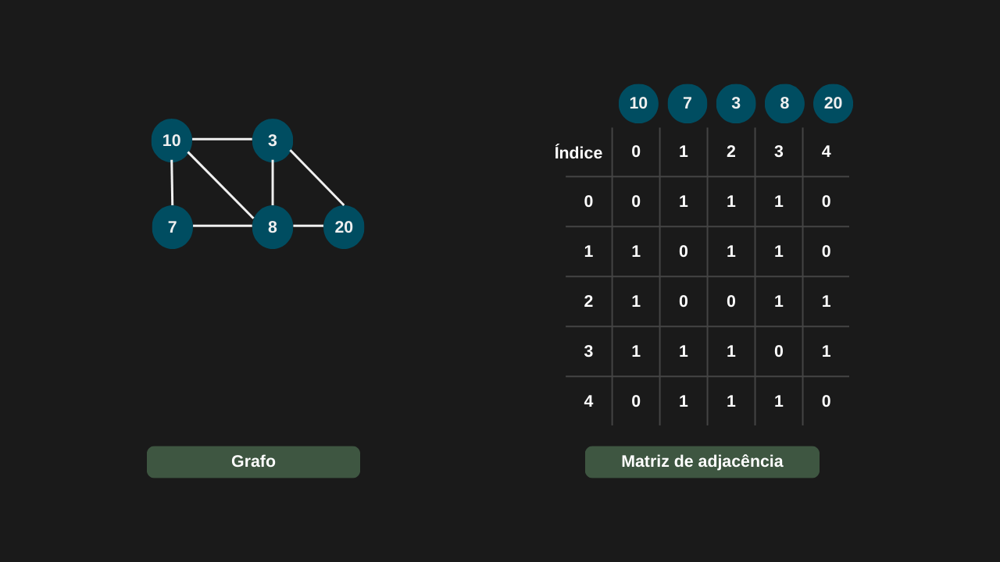
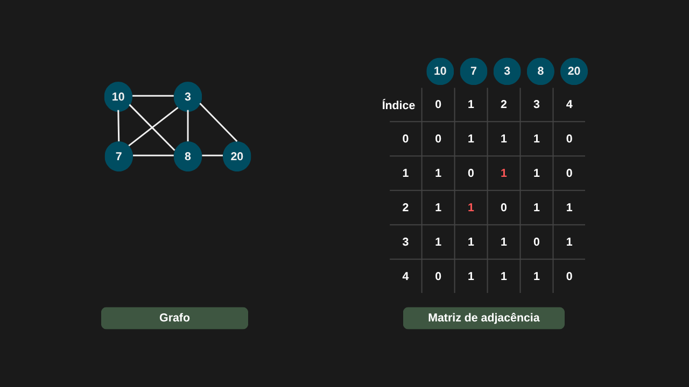
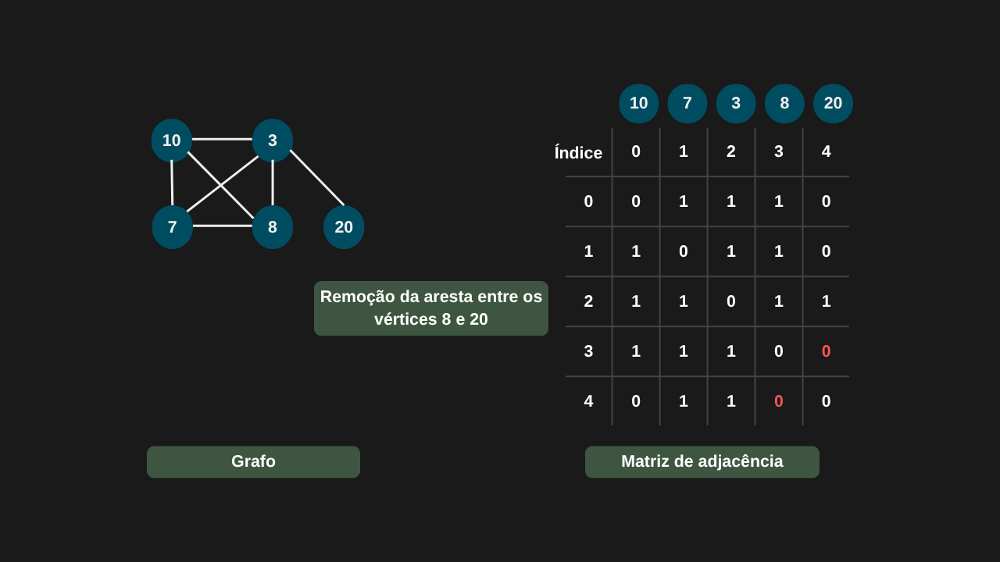
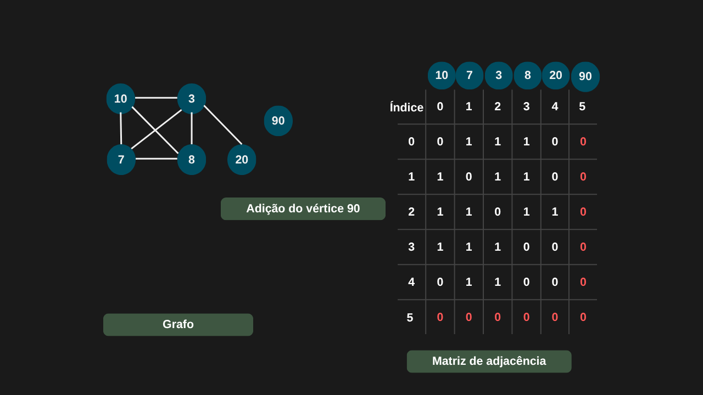
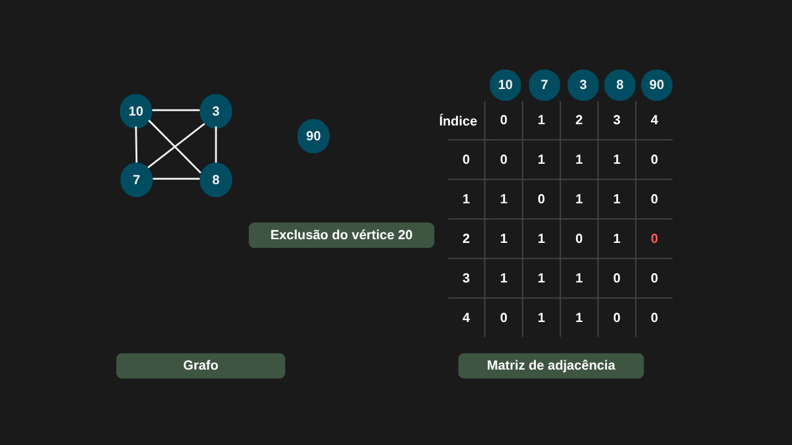

---

comments: true

---

# **Operações básicas em grafos**

As operações em grafos podem ser classificadas em dois tipos principais: aquelas que envolvem vértices e aquelas que envolvem arestas. A forma de implementá-las varia de acordo com a representação escolhida — seja por matriz de adjacência ou por lista de adjacência.

## **Operações usando matriz de adjacência**

Usando um grafo não direcionado como exemplo, podemos considerar as seguintes operações na representação por matriz de adjacência:

- Adição ou remoção de arestas: a modificação é feita diretamente na matriz, acessando a posição correspondente em tempo `O(1)`. No caso de grafos não direcionados, é necessário atualizar as duas posições simétricas da matriz.

- Adição de vértices: requer adicionar uma nova linha e uma nova coluna à matriz, inicializando seus valores com 0. Essa operação tem complexidade `O(n)`.

- Remoção de vértices: envolve a exclusão da linha e da coluna correspondentes ao vértice. No pior caso (remoção da primeira linha e coluna), é preciso deslocar `(n − 1)²` elementos, resultando em complexidade `O(n²)`.

- Inicialização: para criar a matriz de adjacência, é necessário inicializar `n × n` posições com valor 0, o que possui complexidade `O(n²)`.

=== "Inicializando a matriz de adjacência"

    

=== "Adição de arestas"

    

=== "Exclusão de arestas"

    

=== "Adição de vértices"

    

=== "Exclusão de vértices"

    

## **Implementação**

Agora vamos implementar a matriz de adjacência do nosso grafo, considerando que ele pode ser direcionado ou não.

```csharp

public class GrafoMatrizAdjacencia
{
    private int[,] matrizAdjacencia;
    private int quantidadeVertices;
    private bool grafoDirecionado;

    public GrafoMatrizAdjacencia(int numVertices, bool direcionado = false)
    {
        if (numVertices <= 0)
            throw new ArgumentException("Número de vértices deve ser maior que zero.", nameof(numVertices));

        quantidadeVertices = numVertices;
        matrizAdjacencia = new int[numVertices, numVertices];
        grafoDirecionado = direcionado;
    }

    public bool AdicionarAresta(int origem, int destino, int peso = 1)
    {
        if (!VerticesSaoValidos(origem, destino))
            return false;

        matrizAdjacencia[origem, destino] = peso;

        if (!grafoDirecionado)
            matrizAdjacencia[destino, origem] = peso;

        return true;
    }

    public bool RemoverAresta(int origem, int destino)
    {
        if (!VerticesSaoValidos(origem, destino))
            return false;

        matrizAdjacencia[origem, destino] = 0;

        if (!grafoDirecionado)
            matrizAdjacencia[destino, origem] = 0;

        return true;
    }

    public bool ExisteAresta(int origem, int destino)
        => VerticesSaoValidos(origem, destino) && matrizAdjacencia[origem, destino] != 0;

    private bool VerticesSaoValidos(int origem, int destino)
        => origem >= 0 && origem < quantidadeVertices &&
        destino >= 0 && destino < quantidadeVertices;
}

```

!!! tip "Grafo não direcionado"
    Em um grafo não direcionado, a aresta possui o mesmo peso em ambas as direções. Por isso, usamos um `if` para garantir que a matriz seja atualizada em ambos os sentidos.