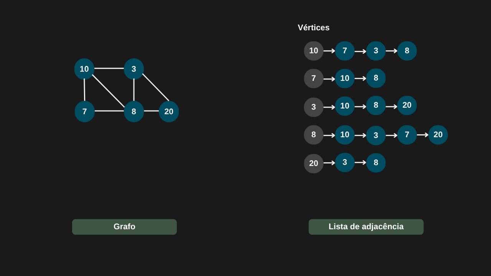

---

comments: true

---

# **Representação de grafos**

As formas mais comuns de representar grafos são por meio de uma matriz de adjacência ou de uma lista de adjacência.

## **Matriz de adjacência**

Dado um grafo com `N` vértices, sua representação por matriz de adjacência utiliza uma matriz `N × N`, em que cada linha e cada coluna correspondem a um vértice. O valor armazenado na posição `(i, j)` indica a existência (ou não) de uma aresta entre os vértices `i` e `j`:

- 0: não existe aresta entre os vértices.
- 1: existe uma aresta entre os vértices (ou outro valor, caso seja um grafo ponderado).
  

As matrizes de adjacência possuem algumas características importantes:

- Diagonal principal: em grafos simples (sem laços), um vértice não pode estar conectado a si mesmo, portanto todos os elementos da diagonal principal são 0.

- Simetria: em grafos não direcionados, uma aresta entre os vértices `i` e `j` é equivalente à aresta entre `j` e `i`. Por isso, a matriz de adjacência é simétrica em relação à diagonal principal.

- Valores armazenados:
    - Em grafos não ponderados, os elementos da matriz indicam apenas a existência (1) ou ausência (0) de uma aresta.
    - Em grafos ponderados, os elementos podem armazenar o peso associado à aresta correspondente.

Quando os grafos são representados por matrizes de adjacência, cada posição da matriz indica a existência (ou o peso) de uma aresta entre dois vértices. Assim, é possível acessar diretamente qualquer elemento da matriz para verificar, inserir, remover ou atualizar uma aresta, o que garante complexidade de tempo `O(1)` para essas operações.

O ponto negativo é o custo de memória: a matriz exige complexidade de espaço `O(n²)`, já que precisa armazenar todas as possíveis conexões entre pares de vértices, mesmo que muitas delas não existam. Por isso, essa representação pode ser pouco eficiente para grafos esparsos (com poucas arestas em relação ao número de vértices).

## **Lista de adjacência**

A lista de adjacência representa um grafo por meio de `n` listas (ou coleções), onde `n` é o número de vértices. Cada lista corresponde a um vértice específico e armazena todos os vértices que são adjacentes a ele, ou seja, aqueles conectados por uma aresta. Dessa forma, a n-ésima lista contém exatamente os vizinhos do vértice `Vn`.

A lista de adjacência armazena apenas as arestas que realmente existem no grafo. Isso a torna muito mais eficiente em termos de espaço quando o número total de arestas é significativamente menor que `n²` (caso típico de grafos esparsos).

Por outro lado, a busca por uma aresta específica pode exigir percorrer toda a lista de vértices adjacentes, o que a torna menos eficiente em tempo quando comparada à matriz de adjacência, onde esse acesso é direto em `O(1)`.

A estrutura da lista de adjacência é bastante semelhante ao encadeamento utilizado em tabelas hash, o que permite aplicar estratégias para otimizar sua eficiência.

  - Quando uma lista encadeada se torna muito extensa, ela pode ser substituída por uma árvore AVL, reduzindo o tempo de busca de `O(n)` para `O(log n)`.
  - Alternativamente, a lista pode ser transformada em uma tabela hash, diminuindo o tempo de procura para `O(1)` em média.

Essas variações tornam a lista de adjacência flexível e adaptável a diferentes cenários, equilibrando espaço e tempo de processamento.