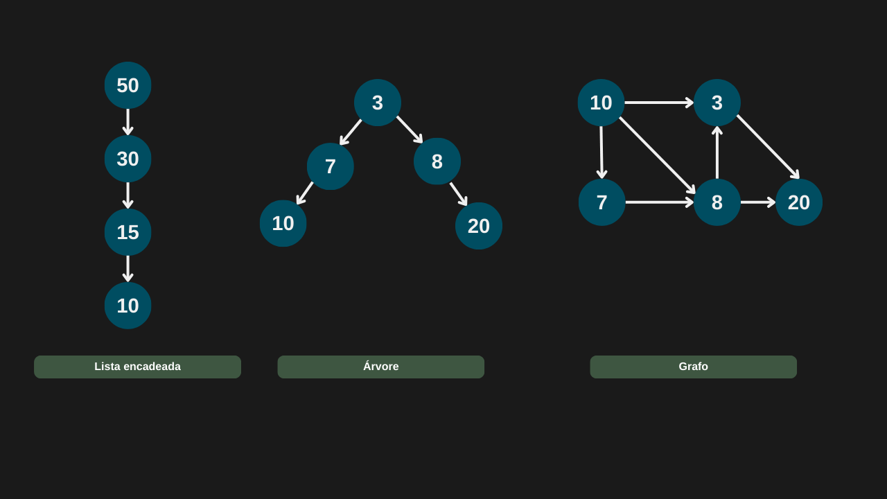
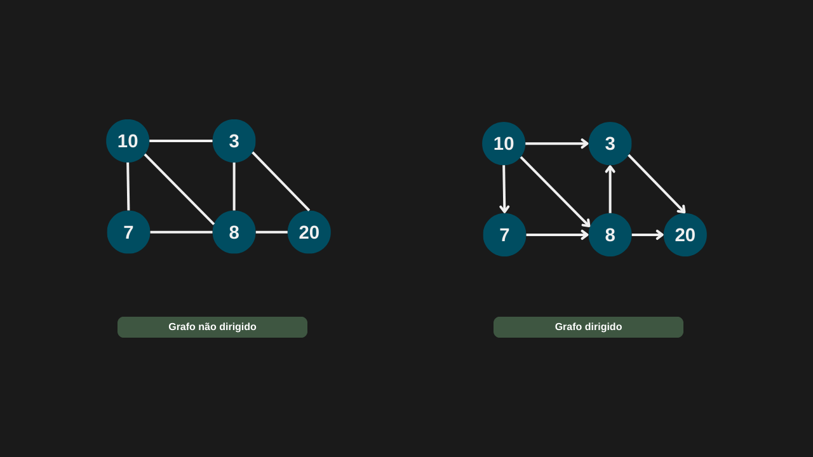
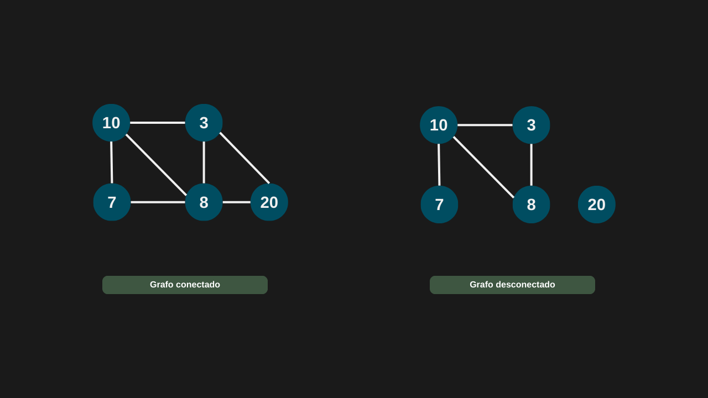
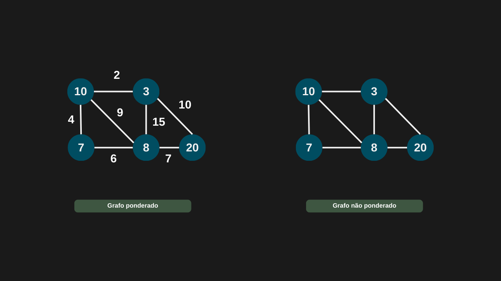

---

comments: true

---

# **Grafos e seus tipos**

Um grafo é uma estrutura de dados composta por vértices (também chamados de nós) e arestas, que representam as conexões entre esses vértices. As arestas podem, ou não, possuir pesos, indicando custos, distâncias ou capacidades relacionadas à conexão.

Além disso, outras estruturas já estudadas, como listas e árvores, podem ser vistas como casos particulares de grafos:

- Uma lista encadeada pode ser representada como um grafo em que cada nó aponta para o próximo.

- Uma árvore é um grafo especial, acíclico e conectado.

## **Tipos de grafos**

Os grafos podem ser classificados em duas categorias principais: dirigidos e não dirigidos, de acordo com a forma como suas arestas se comportam.

- Grafos não dirigidos: as arestas representam conexões bidirecionais entre os vértices. Ou seja, se existe uma aresta entre os vértices A e B, é possível ir de A para B e também de B para A.

- Grafos dirigidos (ou dígrafos): as arestas possuem uma orientação definida, indicando o sentido do caminho. Nesse caso, se há uma aresta de A para B, isso não implica necessariamente que seja possível ir de B para A.

Além de serem dirigidos ou não dirigidos, os grafos também podem ser classificados como conectados ou desconectados, de acordo com suas conexões internas:

- Grafo conectado: existe pelo menos um caminho entre qualquer par de vértices. Assim, ao escolher um vértice inicial, é possível alcançar todos os outros vértices do grafo.

- Grafo desconectado: contém pelo menos um vértice (ou grupo de vértices) que não pode ser alcançado a partir de determinados vértices, devido à ausência de arestas que realizem essa ligação.

Como é possível perceber no exemplo acima, não é possível alcançar o vértice 20.

Os grafos também podem ser classificados como ponderados ou não ponderados, dependendo da presença de valores associados às suas arestas:

- Grafo ponderado: cada aresta possui um peso associado, que pode representar distância, custo, tempo, capacidade, entre outros fatores. Dessa forma, ao analisar o grafo, é possível escolher rotas mais vantajosas, como o caminho de menor custo.

- Grafo não ponderado: as arestas não possuem pesos, ou seja, todas as conexões são consideradas equivalentes. Nesse caso, o que importa é apenas a existência (ou não) da conexão entre os vértices.

Podemos citar alguns termos quando estamos usando estruturas em grafos:

- Adjacência: dois vértices são ditos adjacentes quando estão diretamente conectados por uma aresta. Por exemplo, na figura acima, os vértices adjacentes a 10 são 3, 7 e 8.

- Caminho: é a sequência de arestas percorridas para ir de um vértice A até um vértice B. Na figura acima, um dos caminhos possíveis de 10 até 20 é: 10 → 7 → 8 → 20.

- Grau: corresponde ao número de arestas incidentes em um vértice. Em grafos não dirigidos, esse valor indica apenas a quantidade total de conexões. Já em grafos dirigidos, distinguimos entre:
    - Grau de entrada (in-degree): número de arestas que chegam ao vértice.
    - Grau de saída (out-degree): número de arestas que saem do vértice.