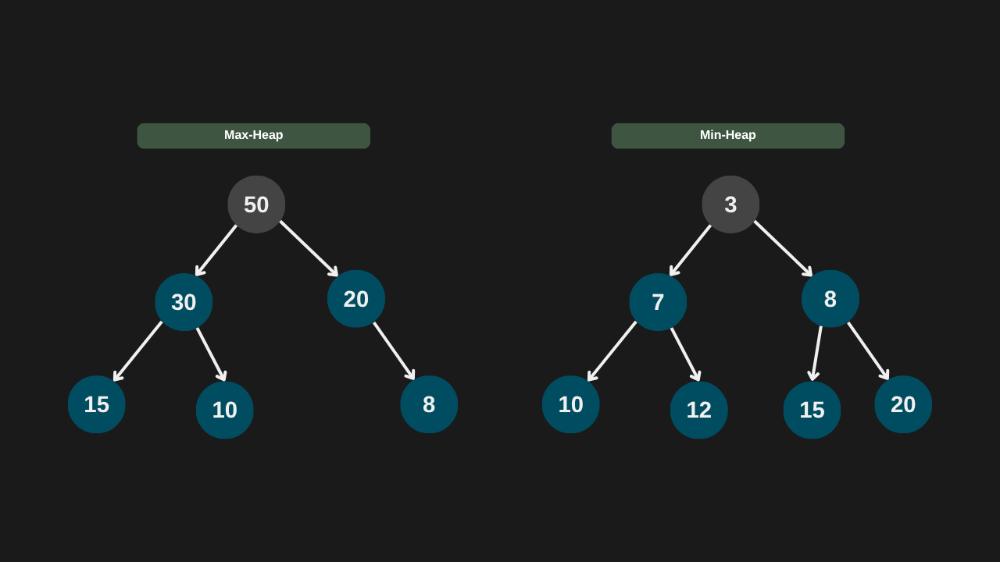

---

comments: true

---

# **Heaps e suas operações**

`Heaps` são estrutura de dados baseadas em árvore binárias completas, comumente usada para a implementação de filas de prioridade.

Pode ser de dois tipos:
1. Max-Heap - o maior valor sempre está no topo (raiz). Cada nó pai é maior ou igual aos seus filhos.
2. Min-Heap - o menor valor está sempre na raiz. Cada nó pai é menor ou igual aos seus filhos.

Ela sempre será uma árvore binária completa, com todos os níveis preenchidos da esquerda para a direita, sem buracos. Normalmente, é representada por um array ou lista. Para um nó na posição `i`, o filho esquerdo está na posição `2i + 1`. Já o direito está na posição `2i + 2`. O pai está na posição `(i -1) / 2`.



## **Heapfy Up e Down**

As funções `Heapfy` são o núcleo da estrutura de uma `heap`. São elas que garantem que a propriedade fundamental da `heap` — manter o maior (em uma Max-Heap) ou o menor (em uma Min-Heap) elemento no topo — seja sempre respeitada.

- `HeapfyUp` é utilizado após uma inserção. Quando um novo valor é adicionado ao final da estrutura, ele pode violar a ordem da heap. O `HeapfyUp` corrige isso subindo o elemento até que ele esteja na posição correta, onde não seja maior que seu pai.

- `HeapifyDown` entra em cena após a remoção do elemento do topo (o maior, no caso da Max-Heap). Como o último item da lista é movido para o topo, ele pode não ser o maior. O `HeapifyDown` empurra esse valor para baixo, trocando com o maior dos filhos, até que a estrutura da heap esteja novamente em ordem.

## **Complexidade**

As operações de inserção e remoção em uma `heap` possuem complexidade `O(log n)` devido à possível necessidade de execução das funções `HeapfyUp` ou `HeapifyDown`. Essas funções podem percorrer a altura da árvore — que é `log n` em uma `heap` binária — para restaurar a propriedade da estrutura.

Por outro lado, o acesso à raiz (o maior ou menor elemento, dependendo do tipo da `heap`) é feito diretamente pelo índice zero da lista, usando a função `Peek`, o que garante uma complexidade `O(1)`.

| Caso         | Complexidade |
|--------------|--------------|
| Peek         | O(1)         |
| Inserção     | O(log n)     |
| Remoção      | O(logn n)    |
| Heapfy       | O(log n)     |

## **Implementação**

```csharp

public class MaxHeap
{
    private List<int> _itens = [];

    public int Tamanho => _itens.Count;

    public int Peek()
    {
        if (Tamanho == 0)
            throw new InvalidOperationException("Heap está vazia.");

        return _itens[0];
    }

    public void Inserir(int valor)
    {
        _itens.Add(valor);
        HeapfyUp(Tamanho - 1);
    }

    public int Remover()
    {
        if (Tamanho == 0)
            throw new InvalidOperationException("Heap está vazia.");

        int topo = _itens[0];
        _itens[0] = _itens[Tamanho - 1];
        _itens.RemoveAt(Tamanho - 1);

        HeapifyDown(0);
        return topo;
    }

    private void HeapfyUp(int indice)
    {
        while (TemPai(indice) && _itens[indice] > PegarPai(indice))
        {
            int indicePai = IndicePai(indice);
            Trocar(indice, indicePai);
            indice = indicePai;
        }
    }

    private void HeapifyDown(int indice)
    {
        int maior = indice;
        int filhoEsquerdo = IndiceFilhoEsquerdo(indice);
        int filhoDireito = IndiceFilhoDireito(indice);

        if (filhoEsquerdo < Tamanho && _itens[filhoEsquerdo] > _itens[maior])
            maior = filhoEsquerdo;

        if (filhoDireito < Tamanho && _itens[filhoDireito] > _itens[maior])
            maior = filhoDireito;

        if (maior != indice)
        {
            Trocar(indice, maior);
            HeapifyDown(maior);
        }
    }

    private int IndiceFilhoEsquerdo(int i) => 2 * i + 1;
    private int IndiceFilhoDireito(int i) => 2 * i + 2;
    private int IndicePai(int i) => (i - 1) / 2;

    private bool TemPai(int i) => IndicePai(i) >= 0;

    private int PegarPai(int i) => _itens[IndicePai(i)];

    private void Trocar(int i, int j)
        => (_itens[j], _itens[i]) = (_itens[i], _itens[j]);
}

```