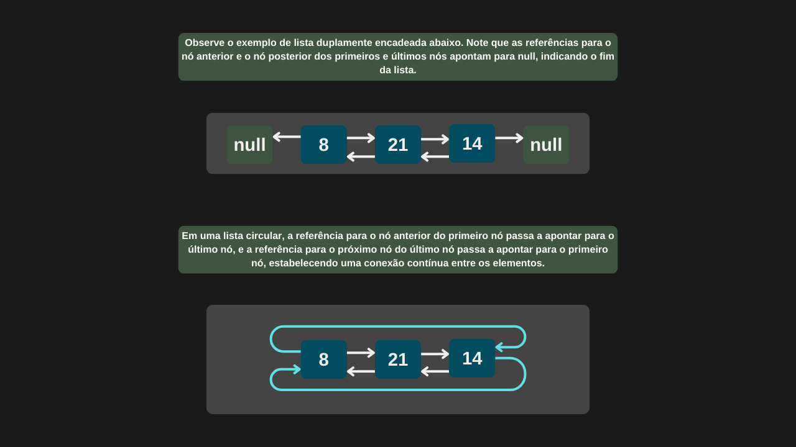

---

comments: true

---

# **Listas circulares duplamente encadeadas**

Uma lista circular duplamente encadeada é semelhante a uma lista duplamente encadeada, com a diferença de que a referência que aponta para o elemento anterior do primeiro nó passa a apontar para o último nó, e a referência que aponta para o próximo nó do último nó passa a apontar para o primeiro nó da lista. Com essa estrutura circular, não é necessário manter uma variável separada para o último nó.

!!! tip "Uso no dia-a-dia"

    Listas circulares duplamente encadeadas são amplamente utilizadas em cenários que exigem percursos contínuos e cíclicos sobre os dados, como em sistemas de escalonamento de processos (Round-Robin), comunicação em tempo real, balanceamento de carga, entre outros.

## **Implementação**

Observe que, ao inicializar um nó, ele é configurado para apontar para si mesmo, tanto no ponteiro `Proximo` quanto no ponteiro `Anterior`, garantindo a circularidade da lista desde o início. Vamos chamar esse nó de `NoCircular`.

```csharp

 public class NoCircular
 {
     public int Valor;
     public NoCircular Proximo;
     public NoCircular Anterior;

     public NoCircular(int valor)
     {
         Valor = valor;
         Proximo = this;
         Anterior = this;
     }
 }

```

```csharp

public class ListaCircularDuplamenteEncadeada
{
    public NoCircular? PrimeiroNo;

    public NoCircular? PegarPrimeiroNo() => PrimeiroNo;

    public NoCircular AdicionarNoInicio(int valor)
    {
        NoCircular novoNo = new(valor);

        if (PrimeiroNo is null)            
            PrimeiroNo = novoNo;
        
        else
        {
            NoCircular? ultimoNo = PrimeiroNo.Anterior;

            novoNo.Proximo = PrimeiroNo;
            novoNo.Anterior = ultimoNo;

            PrimeiroNo.Anterior = novoNo;
            ultimoNo!.Proximo = novoNo;

            PrimeiroNo = novoNo;
        }

        return novoNo;  
    }

    public NoCircular AdicionarNoFim(int valor)
    {
        NoCircular novoNo = new (valor);

        if (PrimeiroNo is null)            
            PrimeiroNo = novoNo;
        
        else
        {
            NoCircular? ultimoNo = PrimeiroNo.Anterior;

            novoNo.Proximo = PrimeiroNo;
            novoNo.Anterior = ultimoNo;

            ultimoNo!.Proximo = novoNo;
            PrimeiroNo.Anterior = novoNo;
        }

        return novoNo;  
    }

    public NoCircular? Remover(int valor)
    {
        if (PrimeiroNo is null)
            return null;

        NoCircular? noAtual = PrimeiroNo;

        do
        {
            if (noAtual!.Valor == valor)
            {
                if (noAtual.Proximo == noAtual)                    
                    PrimeiroNo = null;
                
                else
                {
                    noAtual.Anterior!.Proximo = noAtual.Proximo;
                    noAtual.Proximo!.Anterior = noAtual.Anterior;

                    if (noAtual == PrimeiroNo)
                        PrimeiroNo = noAtual.Proximo;
                }

                noAtual.Proximo = null;
                noAtual.Anterior = null;

                return noAtual; 
            }

            noAtual = noAtual.Proximo;
        } while (noAtual != PrimeiroNo);

        return null;  
    }
}

```

=== "Lista circular duplamente encadeada"

    
