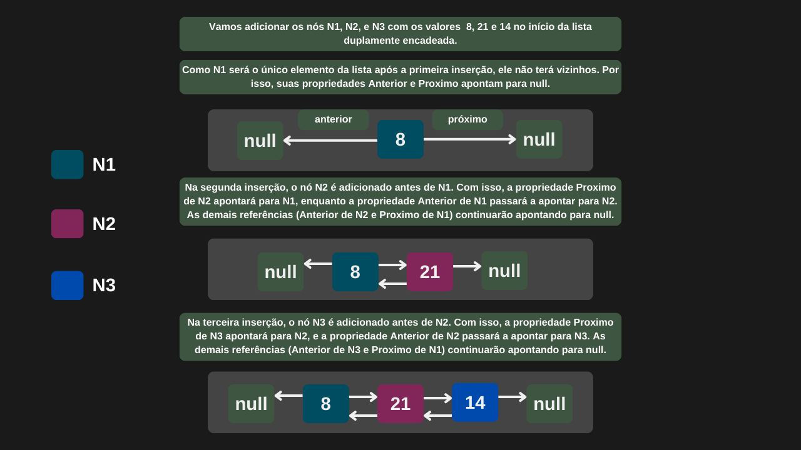
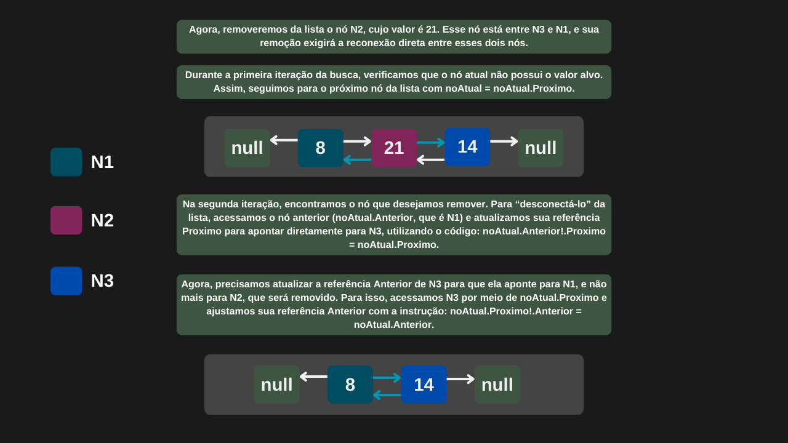

---

comments: true

---

# **Listas duplamente encadeadas padrão em C#**

A linguagem C# oferece uma implementação pronta de lista duplamente encadeada por meio da classe `LinkedList<T>`, disponível no namespace `System.Collections.Generic`. Essa estrutura fornece operações essenciais, como `AddFirst` e `AddLast` para inserção de elementos no início ou no final da lista, respectivamente. Para remoção, podemos utilizar `RemoveFirst`, `RemoveLast` ou `Remove`, que permite remoção de nós no início, final e um nó específico em qualquer posição da lista. Todo o controle interno — incluindo a alocação de memória e o encadeamento dos elementos — é gerenciado automaticamente pela própria estrutura da linguagem, o que facilita seu uso e reduz a complexidade da implementação manual.

As operações de adição retornam um nó já implementado pela linguagem, representado pela classe `LinkedListNode<T>`. Essa classe permite navegar pela estrutura encadeada: o próximo nó pode ser acessado por meio da propriedade `Next`, o nó anterior por `Previous` e o valor armazenado no nó por meio da propriedade `Value`.

## **Implementação**

```csharp

public class ListaDuplamenteEncadeadaCSharp
{
    private LinkedList<int> _listaDuplamenteEncadeada;

    public ListaDuplamenteEncadeadaCSharp()        
        => _listaDuplamenteEncadeada = new LinkedList<int>();        

    public LinkedListNode<int>? PrimeiroNo => _listaDuplamenteEncadeada.First;

    public LinkedListNode<int>? UltimoNo => _listaDuplamenteEncadeada.Last;

    public LinkedListNode<int> AdicionarNoInicio(int valor)
        =>  _listaDuplamenteEncadeada.AddFirst(valor);        

    public LinkedListNode<int> AdicionarNoFinal(int valor)
        => _listaDuplamenteEncadeada.AddLast(valor);

    public void RemoverNoInicio()
        => _listaDuplamenteEncadeada.RemoveFirst();

    public void RemoverNoFinal()
        => _listaDuplamenteEncadeada.RemoveLast();

    public LinkedListNode<int>? Remover(int valor)
    {
        LinkedListNode<int>? noAtual = _listaDuplamenteEncadeada.First;
        
        while (noAtual != null)
        {
            if (noAtual.Value == valor)
            {
                _listaDuplamenteEncadeada.Remove(noAtual);
                return noAtual;
            }

            noAtual = noAtual.Next;
        }

        return null;
    }
}

```

=== "Inserção de nós"

    

=== "Remoção de nós"

    