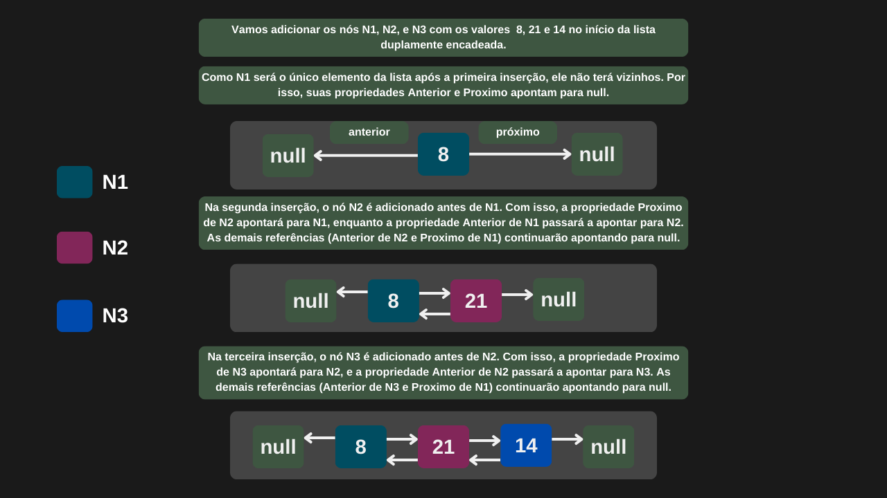

---

comments: true

---

# **Listas duplamente encadeadas e suas operações**

Uma lista duplamente encadeada é uma estrutura de dados linear e dinâmica, composta por nós. A diferença dela para a lista simplesmente encadeada é que cada nó possui um ponteiro para o nó posterior e anterior. Isso permite percorrer a lista tanto para frente quanto para trás.

## **Inserção de nós**

A inserção no início e no fim de uma lista duplamente encadeada possui complexidade `O(1)`, pois são mantidas referências separadas para o primeiro e o último nó da lista. Isso permite adicionar elementos diretamente nessas posições sem percorrer a estrutura. Já para inserir em uma posição intermediária, é necessário percorrer a lista até o ponto desejado, o que resulta em uma complexidade `O(n)`.

## **Remoção de nós**

A remoção no início e no fim de uma lista duplamente encadeada possui complexidade `O(1)`, pois são mantidas referências diretas para o primeiro e o último nó, permitindo a exclusão imediata dessas posições. Já a remoção de um elemento no meio da lista exige um percurso até o nó desejado, resultando em uma complexidade `O(n)`.

## **Pesquisa de valores**

Para encontrar um elemento em uma lista duplamente encadeada, é necessário percorrê-la a partir do início. Se o elemento estiver no primeiro nó, a busca terá complexidade `O(1)`. No pior caso, será necessário percorrer toda a lista, resultando em uma complexidade `O(n)`.

## **Implementação**

```csharp

public class ListaDuplamenteEncadeada
{
    public class No
    {
        public int Valor;
        public No? Proximo;
        public No? Anterior;

        public No(int valor)
        {
            Valor = valor;
            Proximo = null;
            Anterior = null;
        }
    }

    private No? primeiroNo;
    private No? ultimoNo;

    public No AdicionarNoInicio(int valor)
    {
        No novoNo = new No(valor);

        if (primeiroNo == null)
        {
            novoNo.Proximo = null;
            novoNo.Anterior = null;

            primeiroNo = novoNo;
            ultimoNo = novoNo;
        }
        else
        {
            novoNo.Proximo = primeiroNo;
            novoNo.Anterior = null;

            primeiroNo.Anterior = novoNo;
            primeiroNo = novoNo;
        }

        return novoNo;
    }

    public No AdicionarNoFinal(int valor)
    {
        No novoNo = new No(valor);

        if (ultimoNo == null)
        {
            novoNo.Proximo = null;
            novoNo.Anterior = null;

            primeiroNo = novoNo;
            ultimoNo = novoNo;
        }
        else
        {
            novoNo.Anterior = ultimoNo;
            novoNo.Proximo = null;

            ultimoNo.Proximo = novoNo;
            ultimoNo = novoNo;
        }

        return novoNo;
    }

    public No? Remover(int valor)
    {
        No? noAtual = primeiroNo;

        while (noAtual != null)
        {
            if (noAtual.Valor == valor)
            {
                if (noAtual == primeiroNo)
                {
                    primeiroNo = primeiroNo.Proximo;

                    if (primeiroNo != null)
                        primeiroNo.Anterior = null;
                    else
                        ultimoNo = null;
                }
                else if (noAtual == ultimoNo)
                {
                    ultimoNo = ultimoNo.Anterior;

                    if (ultimoNo != null)
                        ultimoNo.Proximo = null;
                    else
                        primeiroNo = null;
                }
                else
                {
                    noAtual.Anterior!.Proximo = noAtual.Proximo;
                    noAtual.Proximo!.Anterior = noAtual.Anterior;
                }

                noAtual.Proximo = null;
                noAtual.Anterior = null;

                return noAtual;
            }

            noAtual = noAtual.Proximo;
        }

        return null;
    }
}

```

```csharp

ListaDuplamenteEncadeada listaDuplamenteEncadeada = new ListaDuplamenteEncadeada();

ListaDuplamenteEncadeada.No no1 = listaDuplamenteEncadeada.AdicionarNoInicio(8);
Console.WriteLine($"O nó com valor {no1.valor} foi adicionado.");

ListaDuplamenteEncadeada.No no2 = listaDuplamenteEncadeada.AdicionarNoInicio(21);
Console.WriteLine($"O nó com valor {no2.valor} foi adicionado.");

ListaDuplamenteEncadeada.No no3 = listaDuplamenteEncadeada.AdicionarNoInicio(14);
Console.WriteLine($"O nó com valor {no3.valor} foi adicionado.");

ListaDuplamenteEncadeada.No no4 = listaDuplamenteEncadeada.Remover(21);
Console.WriteLine($"O nó com valor {no4.valor} foi removido.");

```

=== "Inserção de nós"

    

=== "Remoção de nós"

    