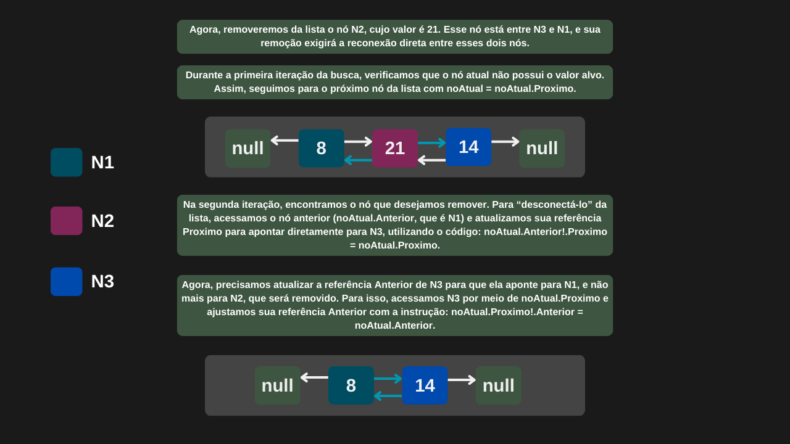

---

comments: true

---

# **Listas duplamente encadeadas e suas operações**

Uma lista duplamente encadeada é uma estrutura de dados linear e dinâmica, composta por nós. A diferença dela para a lista simplesmente encadeada é que cada nó possui um ponteiro para o nó posterior e anterior. Isso permite percorrer a lista tanto para frente quanto para trás.

## **Inserção de nós**

A inserção no início e no fim de uma lista duplamente encadeada possui complexidade `O(1)`, pois são mantidas referências separadas para o primeiro e o último nó da lista. Isso permite adicionar elementos diretamente nessas posições sem percorrer a estrutura. Já para inserir em uma posição intermediária, é necessário percorrer a lista até o ponto desejado, o que resulta em uma complexidade `O(n)`.

| Caso         | Complexidade |
|--------------|--------------|
| Melhor caso  | O(1)         |
| Caso médio   | O(n)         |
| Pior caso    | O(n)         |

## **Remoção de nós**

A remoção no início e no fim de uma lista duplamente encadeada possui complexidade `O(1)`, pois são mantidas referências diretas para o primeiro e o último nó, permitindo a exclusão imediata dessas posições. Já a remoção de um elemento no meio da lista exige um percurso até o nó desejado, resultando em uma complexidade `O(n)`.

| Caso         | Complexidade |
|--------------|--------------|
| Melhor caso  | O(1)         |
| Caso médio   | O(n)         |
| Pior caso    | O(n)         |

## **Pesquisa de valores**

Para encontrar um elemento em uma lista duplamente encadeada, é necessário percorrê-la a partir do início. Se o elemento estiver no primeiro nó, a busca terá complexidade `O(1)`. No pior caso, será necessário percorrer toda a lista, resultando em uma complexidade `O(n)`.

| Caso         | Complexidade |
|--------------|--------------|
| Melhor caso  | O(1)         |
| Caso médio   | O(n)         |
| Pior caso    | O(n)         |

!!! tip "Uso no dia-a-dia"

    Listas duplamente encadeadas são amplamente utilizadas em diversos cenários, como o gerenciamento de processos em sistemas operacionais, a gestão de memória, sistemas de edição de texto e outras aplicações que exigem manipulação eficiente e bidirecional de dados.


## **Implementação**

Note o novo atributo que referencia o nó anterior. Chamaremos essa estrutura de `NoDuplamenteEncadeado`.

```csharp

public class NoDuplamenteEncadeado
{
    public int Valor;
    public NoDuplamenteEncadeado? Proximo;
    public NoDuplamenteEncadeado? Anterior;

    public NoDuplamenteEncadeado(int valor)
    {
        Valor = valor;
        Proximo = null;
        Anterior = null;
    }
}

```

```csharp

ppublic class ListaDuplamenteEncadeada
{
    public NoDuplamenteEncadeado PrimeiroNo;
    public NoDuplamenteEncadeado UltimoNo;

    public NoDuplamenteEncadeado? PegarPrimeiroNo() => PrimeiroNo;

    public NoDuplamenteEncadeado? PegarUltimoNo() => UltimoNo;

    public NoDuplamenteEncadeado AdicionarNoInicio(int valor)
    {
        NoDuplamenteEncadeado novoNo = new NoDuplamenteEncadeado(valor);

        if (PrimeiroNo is null)
        {
            novoNo.Proximo = null;
            novoNo.Anterior = null;

            PrimeiroNo = novoNo;
            UltimoNo = novoNo;
        }
        else
        {
            novoNo.Proximo = PrimeiroNo;
            novoNo.Anterior = null;

            PrimeiroNo.Anterior = novoNo;
            PrimeiroNo = novoNo;
        }

        return novoNo;
    }

    public NoDuplamenteEncadeado AdicionarNoFinal(int valor)
    {
        NoDuplamenteEncadeado novoNo = new NoDuplamenteEncadeado(valor);

        if (UltimoNo is null)
        {
            novoNo.Proximo = null;
            novoNo.Anterior = null;

            PrimeiroNo = novoNo;
            UltimoNo = novoNo;
        }
        else
        {
            novoNo.Anterior = UltimoNo;
            novoNo.Proximo = null;

            UltimoNo.Proximo = novoNo;
            UltimoNo = novoNo;
        }

        return novoNo;
    }

    public NoDuplamenteEncadeado Remover(int valor)
    {
        NoDuplamenteEncadeado noAtual = PrimeiroNo;

        while (noAtual is not null)
        {
            if (noAtual.Valor == valor)
            {
                if (noAtual == PrimeiroNo)
                {
                    PrimeiroNo = PrimeiroNo.Proximo;

                    if (PrimeiroNo is not null)
                        PrimeiroNo.Anterior = null;
                    
                    else
                        UltimoNo = null;
                }

                else if (noAtual == UltimoNo)
                {
                    UltimoNo = UltimoNo.Anterior;

                    if (UltimoNo is not null)
                        UltimoNo.Proximo = null;
                    
                    else
                        PrimeiroNo = null;
                }

                else
                {
                    noAtual.Anterior!.Proximo = noAtual.Proximo;
                    noAtual.Proximo!.Anterior = noAtual.Anterior;
                }

                noAtual.Proximo = null;
                noAtual.Anterior = null;

                return noAtual;
            }

            noAtual = noAtual.Proximo;
        }

        return null;
    }
}

```

=== "Inserção de nós"

    

=== "Remoção de nós"

    