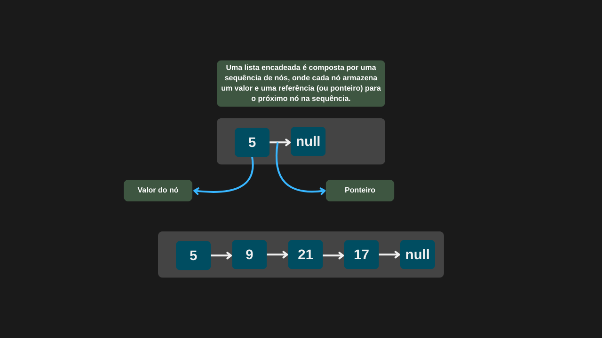

---

comments: true

---

# **Listas encadeadas padrão em C#**

A linguagem C# disponibiliza uma estrutura de lista pronta por meio da classe `List<T>`, presente no namespace `System.Collections.Generic`. Essa estrutura oferece operações fundamentais, como `Add` para inserção de elementos e `Remove` para remoção. Todo o gerenciamento interno — como alocação de memória e reorganização dos elementos — é automaticamente tratado pela própria implementação da linguagem.

## **Implementação**

```csharp

public class ListaEncadeadaCSharp
{
    private List<int> numeros;

    public ListaEncadeadaCSharp()
        => numeros = new List<int>();        

    public void Adicionar(int valor)
        => numeros.Add(valor);

    public bool Remover(int valor)
        => numeros.Remove(valor);
}

```

=== "Inicializando uma lista"

    

=== "Inserção de nós"

    

=== "Remoção de nós"

    