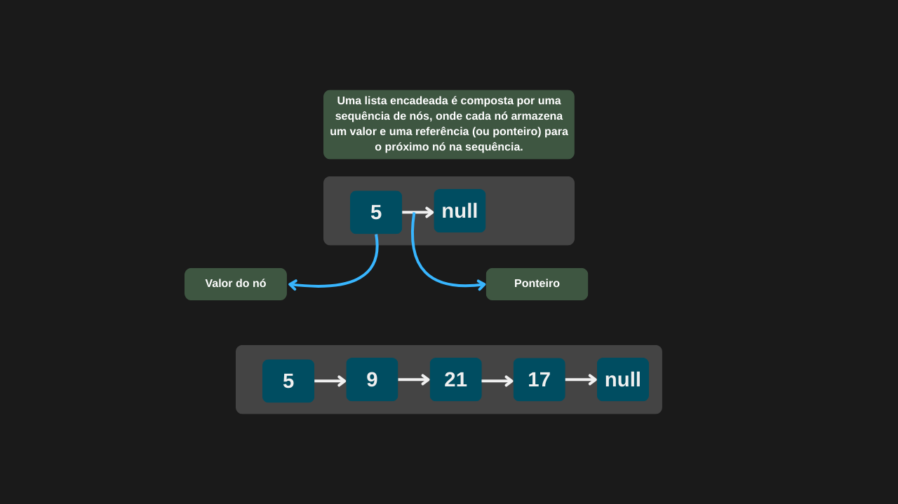
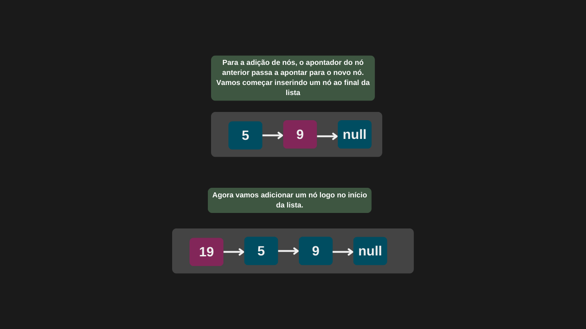
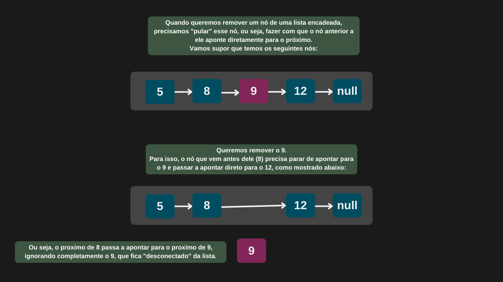

---

comments: true

---

# **Listas encadeadas e suas operações**

Uma lista encadeada é uma estrutura de dados onde os elementos, chamados de nós, são organizados de forma linear. Diferente de um array, a ordem dos elementos não depende de posições fixas na memória, mas sim de ponteiros (ou referências) que conectam um nó ao próximo.

Cada nó armazena dois dados principais:

1. O valor em si (como um número ou uma string),

2. Um ponteiro para o próximo nó da lista.

Essa estrutura é dinâmica, o que significa que ela pode crescer com novas inserções e diminuir com remoções, sem a necessidade de criar cópias ou redefinir o tamanho da lista — ao contrário do que acontece com arrays fixos.

A flexibilidade da lista encadeada a torna ideal para situações onde o número de elementos pode variar bastante durante a execução do programa.

## **Inserção de nós**

A inserção de um novo nó no início de uma lista encadeada tem complexidade `O(1)`. Isso porque basta criar um novo nó e fazer com que ele aponte para o antigo primeiro nó — um processo direto, que não depende do tamanho da lista.

Já a inserção no final de uma lista simplesmente encadeada, em geral, tem complexidade `O(n)`, pois é necessário percorrer toda a lista até encontrar o último nó. Contudo, se a lista mantiver uma referência direta para o último nó (como em uma implementação com ponteiro para o tail), essa operação pode ser otimizada para `O(1)`.

Por fim, inserir em uma posição específica exige percorrer a lista até o ponto desejado, o que resulta em complexidade `O(n)`, já que, em média, é necessário visitar metade dos elementos.

## **Remoção de nós**

Remover um nó do início de uma lista encadeada é uma operação de complexidade `O(1)`. Isso ocorre porque basta atualizar o ponteiro do primeiro nó para apontar para o segundo — uma ação direta, independente do tamanho da lista.

Por outro lado, a remoção de um nó em uma posição específica ou no final da lista exige percorrer os elementos até o ponto desejado. Como não há acesso direto aos nós anteriores, é necessário visitar cada um sequencialmente até chegar ao nó anterior ao que será removido, apresentando complexidade `O(n)`.

## **Pesquisa de dados**

Como os elementos de uma lista encadeada não estão armazenados de forma contígua na memória, não é possível acessar diretamente um nó específico. Para encontrar um valor, é necessário percorrer a lista a partir do primeiro nó, um a um, até localizar o dado desejado ou atingir o final da lista.

Portanto, a complexidade da operação de busca é `O(n)`, onde n representa o número de elementos da lista.

## **Implementação**

Uma lista encadeada é formada por elementos chamados de nós. Por isso, o primeiro passo para sua implementação é criar a classe que representa esses nós.

```csharp

public class No
{
    public int valor;
    public No? proximo;

    public No(int Valor)
    {
        valor = Valor;
        proximo = null;            
    }
}

```

Agora que temos a estrutura dos nós definida, podemos começar a construir a nossa lista encadeada.

```csharp

public class ListaEncadeada
{
    private No? primeiroNo;

    public ListaEncadeada()
        => primeiroNo = null;

    public No AdicionarInicio(int valor)
    {
        No novoNo = new No(valor);
        novoNo.proximo = primeiroNo;
        primeiroNo = novoNo;

        return primeiroNo;
    }

    public No AdicionarFim(int valor)
    {
        No novoNo = new No(valor);

        if (primeiroNo is null)
        {
            primeiroNo = novoNo;
            return novoNo;
        }

        No noAtual = primeiroNo;

        while (noAtual.proximo is not null)
            noAtual = noAtual.proximo;

        noAtual.proximo = novoNo;

        return novoNo;
    }

    public No? RemoverInicio()
    {
        if (primeiroNo is null)
            return null;

        No noRemovido = primeiroNo;
        primeiroNo = primeiroNo.proximo;
        noRemovido.proximo = null;
        return noRemovido;
    }

    public No? RemoverFim()
    {
        if (primeiroNo is null)
            return null;

        if (primeiroNo.proximo is null)
        {
            No noUnico = primeiroNo;
            primeiroNo = null;
            return noUnico;
        }

        No? noAtual = primeiroNo;

        while (noAtual.proximo!.proximo is not null)
            noAtual = noAtual.proximo;

        No noRemovido = noAtual.proximo;
        noAtual.proximo = null;
        return noRemovido;
    }

    public No? RemoverNo(int posicao)
    {
        if (posicao < 0 || primeiroNo is null)
            return null;

        if (posicao == 0)
            return RemoverInicio();

        No noAtual = primeiroNo;
        int indice = 0;

        while (noAtual.proximo is not null && indice < posicao - 1)
        {
            noAtual = noAtual.proximo;
            indice = indice + 1;
        }

        if (noAtual.proximo is null)
            return null;

        No noRemovido = noAtual.proximo;
        noAtual.proximo = noRemovido.proximo;
        noRemovido.proximo = null;

        return noRemovido;
    }

    public No? Pesquisar(int valor)
    {
        No? noAtual = primeiroNo;

        while (noAtual is not null)
        {
            if (noAtual.valor == valor)
                return noAtual;

            noAtual = noAtual.proximo;
        }

        return null;
    }

    public int Size()
    {
        int quantidadeNos = 0;

        No? noAtual = primeiroNo;

        while (noAtual is not null)
        {
            noAtual = noAtual.proximo;
            quantidadeNos = quantidadeNos + 1;
        }

        return quantidadeNos;
    }

    public bool IsEmpty()
        => primeiroNo is null;
}

```

```csharp

ListaEncadeada listaEncadeada = = new ListaEncadeada();

No no = listaEncadeada.AdicionarInicio(10);

Console.WriteLine($"O nó com valor {no.valor} foi adicionado.");

listaEncadeada.AdicionarInicio(20);

No noRemovido = listaEncadeada.RemoverInicio();

Console.WriteLine($"O nó com valor {noRemovido.valor} foi removido.");

```

=== "Inicializando uma lista"

    

=== "Inserção de nós em uma lista"

    

=== "Remoção de nós em uma lista"

    