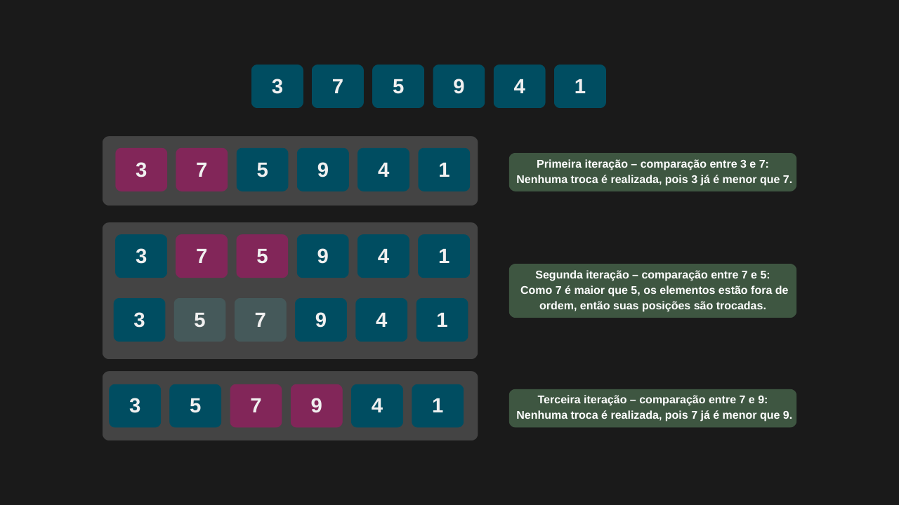
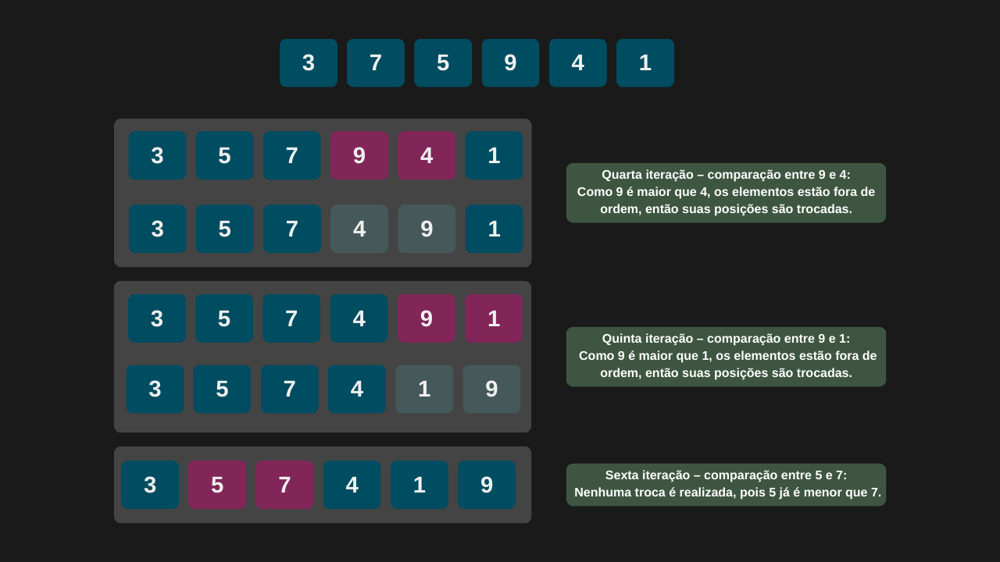
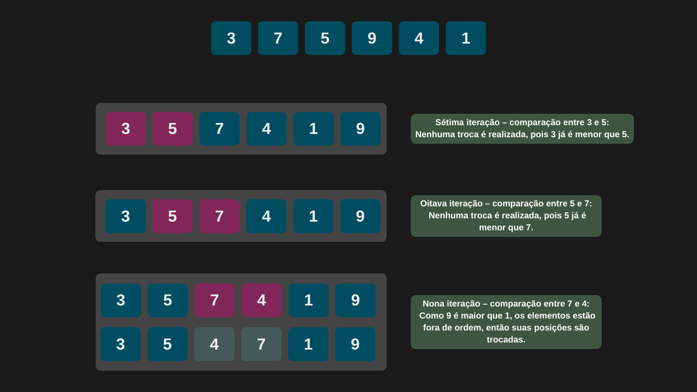
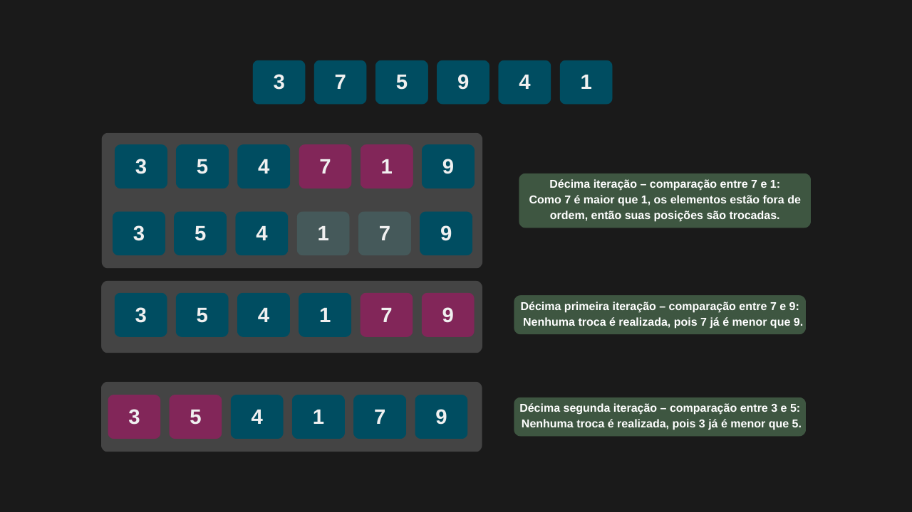
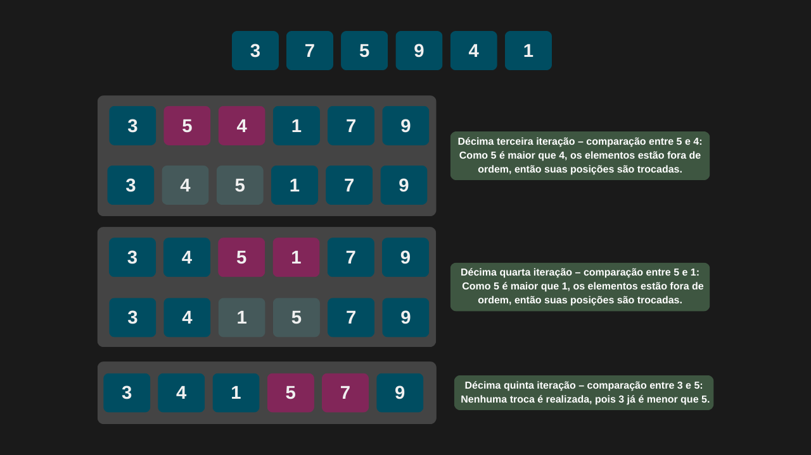
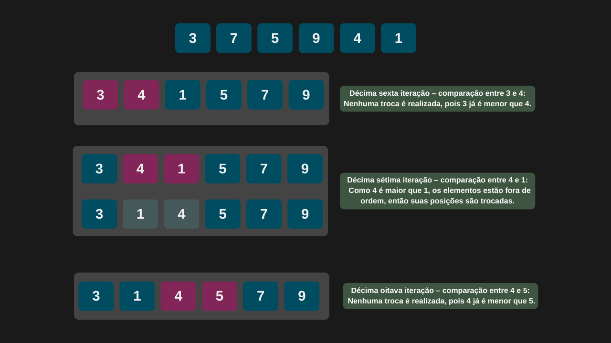
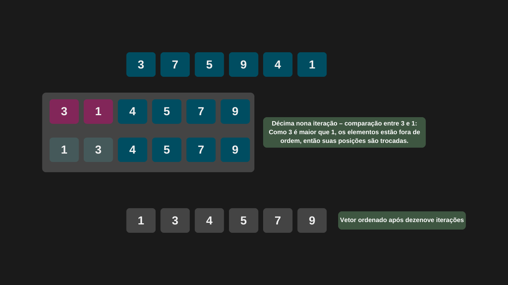

---

comments: true

---

# **Ordenação usando o método da bolha (Bubble Sort)**

O método de ordenação por bolha (Bubble Sort) é um algoritmo simples que percorre um vetor, comparando pares de elementos adjacentes e trocando-os de posição sempre que estão fora de ordem. Esse processo se repete até que todos os elementos estejam organizados na ordem desejada.

## **Complexidade**

Em termos de complexidade, o Bubble Sort possui desempenho quadrático, ou seja, `O(n²)` no pior e no caso médio — o que o torna ineficiente para conjuntos de dados grandes.

No entanto, em situações onde o vetor já está ordenado, ele realiza apenas uma passada sem efetuar trocas, alcançando assim um desempenho de `O(n)` no melhor caso.

| Caso         | Complexidade |
|--------------|--------------|
| Melhor caso  | O(n)         |
| Caso médio   | O(n²)        |
| Pior caso    | O(n²)        |


!!! tip "Uso no dia-a-dia"

    Ele é ineficiente para conjuntos de dados grandes devido à sua baixa eficiência em termos de tempo de execução.

## **Algoritmo**

O algoritmo Bubble Sort funciona da seguinte forma:

1. Receba o vetor (ou lista) a ser ordenado e determine seu tamanho (número de elementos).

2. Crie um laço externo que irá controlar o número de passadas pelo vetor — ele irá do primeiro elemento até o penúltimo.

3. Dentro do laço externo, crie um laço interno que percorre o vetor do início até o último elemento não ordenado (ou seja, do início até `tamanho - i - 1`, onde `i` é o índice da iteração externa).

4. Compare os elementos adjacentes: se o elemento atual for maior que o próximo, troque suas posições.

5. Repita esse processo até que todas as passadas sejam concluídas e o vetor esteja completamente ordenado.

## **Implementação**

```csharp

public int[] BubbleSort(int[] vetor)
{
    int quantidadeElementos = vetor.Length;

    for (int indice = 0; indice < quantidadeElementos - 1; indice++)
    {
        for (int indiceAux = 0; indiceAux < quantidadeElementos - indice - 1; indiceAux++)
        {
            if (vetor[indiceAux] > vetor[indiceAux + 1])
                Swap(vetor, indiceAux);
        }
    }

    return vetor;
}

private void Swap(int[] vetorDesordenado, int indice)
{
    int auxiliar = vetorDesordenado[indice];
    vetorDesordenado[indice] = vetorDesordenado[indice + 1];
    vetorDesordenado[indice + 1] = auxiliar;
}

```

```csharp

int[] vetorDesordenado = { 3, 7, 5, 9, 4, 1 };

int[] vetorOrdenado = _metodosOrdenacao.BubbleSort(vetorDesordenado);

Console.WriteLine($"O vetor ordenado é: {string.Join(", ", vetorOrdenado)}.");

```

=== "Bubble Sort 1"

    

=== "Bubble Sort 2"

    

=== "Bubble Sort 3"

    

=== "Bubble Sort 4"

    

=== "Bubble Sort 5"

    

=== "Bubble Sort 6"

    

=== "Bubble Sort 7"

    