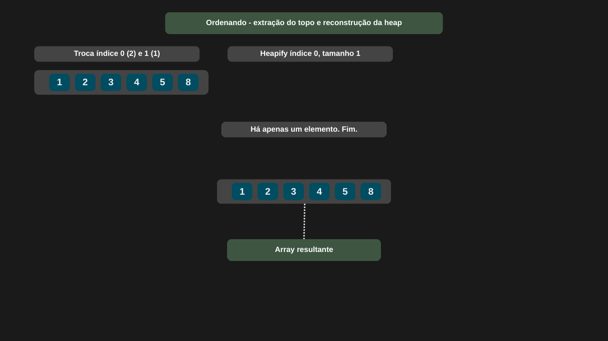

---

comments: true

---

# **Ordenação usando o método de ordenação por heap (Heap Sort)**

??? tip "Se perdeu ?"

    Antes de prosseguir, é importante que você revise a página sobre `heaps` para compreender melhor os conceitos envolvidos.

O `Heap Sort` é um algoritmo de ordenação baseado na estrutura de dados `heap`. Ele pode ser implementado tanto com um `max-heap` quanto com um `min-heap`. Ao utilizar um `max-heap`, o array será ordenado em ordem crescente. Já com um `min-heap`, o resultado será uma ordenação em ordem decrescente.

## **Algoritmo**

Ele funciona da seguinte forma:

1. Construção do `max-heap`:
O `array` original é reorganizado para satisfazer as propriedades de um `max-heap`. A partir do meio do `array` até o início, a função `Heapify` é chamada para cada elemento. Dessa forma, todas as subárvores são ajustadas corretamente, transformando o `array` em um `max-heap`.

2. Ordenação do `array`:
Com o maior elemento posicionado no topo (índice 0), ele é trocado com o último elemento ainda não ordenado. Em seguida, o tamanho da heap é reduzido (ignorando a última posição, que já está ordenada) e a função `Heapify` é chamada novamente para reorganizar a `heap`. Esse processo se repete até que reste apenas um elemento.

3. Ajuste da `heap`:
A função `Heapify` garante que a propriedade do `max-heap` seja mantida. Ela compara o valor do nó pai com os valores de seus filhos e realiza a troca quando necessário, caso um dos filhos seja maior que o pai. Após a troca, `Heapify` é chamada recursivamente para corrigir a subárvore afetada.

## **Complexidade**

Em todos os casos, a complexidade é `O(n log n)`.

| Caso         | Complexidade |
|--------------|--------------|
| Melhor caso  | O(n log n)   |
| Caso médio   | O(n log n)   |
| Pior caso    | O(n log n)   |

!!! tip "Uso no dia-a-dia"

    Algumas bibliotecas podem usar heap structures para implementar ordenações parciais ou em etapas, mas normalmente usam algoritmos híbridos mais rápidos (como o `IntroSort`, que combina `Heap Sort` + `QuickSort` + `Insertion Sort`). O `OrderBy` do `Linq` em `C#` usa o `IntroSort`.


## **Implementação**

```csharp

public class HeapSort
{
    public void Sort(int[] array)
    {
        int tamanho = array.Length;

        for (int i = tamanho / 2 - 1; i >= 0; i--)
            Heapify(array, tamanho, i);

        for (int i = tamanho - 1; i >= 0; i--)
        {
            Trocar(array, 0, i);

            Heapify(array, i, 0);
        }
    }

    private void Heapify(int[] array, int tamanho, int indice)
    {
        int indiceMaiorValor = indice;
        int filhoEsquerdo = 2 * indice + 1;
        int filhoDireito = 2 * indice + 2;

        if (filhoEsquerdo < tamanho && array[filhoEsquerdo] > array[indiceMaiorValor])
            indiceMaiorValor = filhoEsquerdo;

        if (filhoDireito < tamanho && array[filhoDireito] > array[indiceMaiorValor])
            indiceMaiorValor = filhoDireito;

        if (indiceMaiorValor != indice)
        {
            Trocar(array, indice, indiceMaiorValor);
            Heapify(array, tamanho, indiceMaiorValor);
        }
    }

    private void Trocar(int[] array, int i, int j)
        => (array[j], array[i]) = (array[i], array[j]);        
}

```

=== "Heap Sort 01"

    

=== "Heap Sort 02"

    

=== "Heap Sort 03"

    

=== "Heap Sort 04"

    

=== "Heap Sort 05"

    

=== "Heap Sort 06"

    