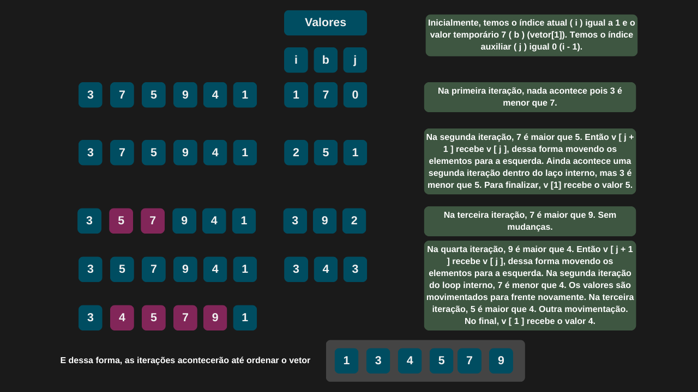

---

comments: true

---

# **Ordenação usando o método de inserção (Insertion sort)**

O algoritmo de ordenação por inserção (Insertion Sort) parte do princípio de que o primeiro elemento do vetor já está em ordem. A partir do segundo, cada novo valor é comparado com os anteriores e inserido na posição correta, deslocando os elementos maiores uma posição à frente para abrir espaço. Esse processo se repete até que todos os elementos estejam ordenados, formando uma sequência crescente a partir da esquerda. Com isso, a cada passo, o vetor vai se tornando parcialmente ordenado, até que esteja totalmente organizado ao final das iterações.

## **Complexidade**

Em termos de desempenho, o Insertion Sort apresenta complexidade quadrática no pior e no caso médio, representada por `O(n²)`, pois, em cenários desfavoráveis, ele pode realizar um grande número de comparações e deslocamentos. No entanto, se o vetor estiver quase ordenado, o algoritmo se torna bem mais eficiente, alcançando uma complexidade linear, `O(n)`, no melhor caso.

Sua performance do algoritmo pode ser resumida da seguinte forma:

| Caso         | Complexidade |
|--------------|--------------|
| Melhor caso  | O(n)         |
| Caso médio   | O(n²)        |
| Pior caso    | O(n²)        |

!!! tip "Uso no dia-a-dia"

    Esse algoritmo tende a ser mais eficiente que o Bubble Sort e o Selection Sort, especialmente quando aplicado a conjuntos pequenos de dados ou quase ordenados. No entanto, devido à sua complexidade quadrática no pior caso, o Insertion Sort não é indicado para grandes volumes de dados, já que seu tempo de execução cresce rapidamente com o tamanho da entrada.

## **Algoritmo**

O algoritmo de inserção funciona da seguinte maneira:

1. Inicie um laço que percorra o vetor a partir do segundo elemento.

2. Armazene o valor atual em uma variável chamada valorTemporario.

3. Utilize um laço interno para comparar esse valor com os elementos anteriores.

4. Enquanto os elementos anteriores forem maiores que valorTemporario, mova-os uma posição à frente.

5. Continue o processo até encontrar um valor menor ou igual, ou até alcançar o início do vetor.

6. Insira valorTemporario na posição correta.

7. Repita o processo para todos os elementos do vetor.

## **Implementação**

```csharp

 public int[] InsertionSort(int[] vetor)
 {
     int quantidadeElementos = vetor.Length;

     for (int indiceAtual = 1; indiceAtual < quantidadeElementos; indiceAtual++)
     {
         int valorTemporario = vetor[indiceAtual];
         int indiceAuxiliar = indiceAtual - 1;

         while(indiceAuxiliar >= 0 && vetor[indiceAuxiliar] > valorTemporario)
         {
             vetor[indiceAuxiliar + 1] = vetor[indiceAuxiliar];
             indiceAuxiliar = indiceAuxiliar - 1;
         }

         vetor[indiceAuxiliar + 1] = valorTemporario;
     }

     return vetor;
 }

```

```csharp

    int[] vetorDesordenado = [3, 7, 5, 9, 4, 1];

    int[] vetorOrdenado = _metodosOrdenacao.InsertionSort(vetorDesordenado);

    Console.WriteLine($"O vetor ordenado é: {string.Join(", ", vetorOrdenado)}.");

```

=== "Insertion Sort"

    