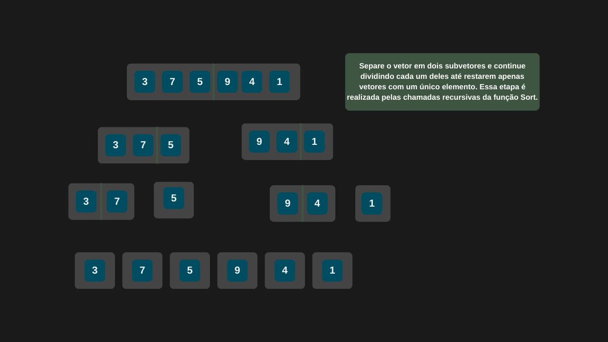
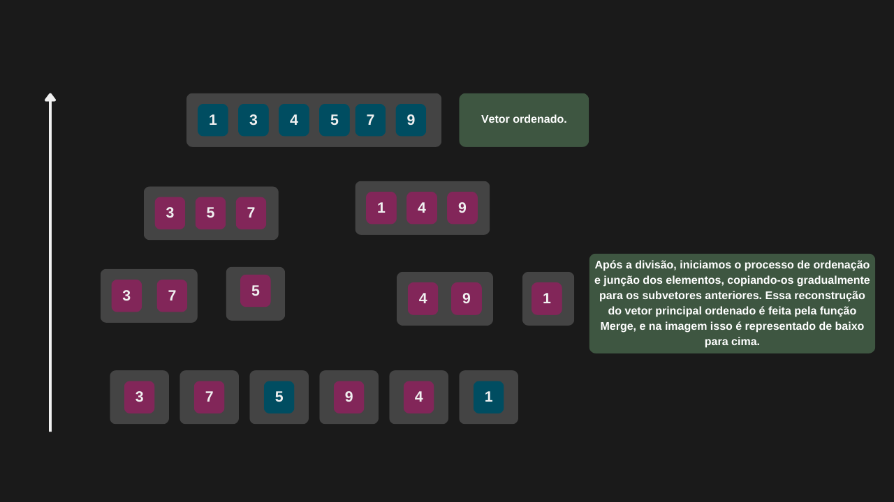

---

comments: true

---

# **Ordenação usando o Merge Sort**

O algoritmo de ordenação Merge Sort é mais um exemplo clássico da estratégia de dividir para conquistar. Ele começa dividindo o vetor original em dois subvetores, e continua dividindo cada um deles recursivamente até que restem apenas subvetores com um único elemento. Em seguida, esses subvetores são ordenados e mesclados de forma progressiva, até que o vetor original seja reconstruído — agora, totalmente ordenado.

## **Algoritmo**

O Merge Sort funciona da seguinte forma:

1. Verifique o tamanho do vetor. Se o vetor tem 0 ou 1 elemento, ele já está ordenado. Esse é o caso base da recursão.

2. Divida o vetor ao meio. Encontre o índice do meio do vetor e divida-o em dois subvetores: um da esquerda e outro da direita.

3. Chame a função Sort para os dois subvetores. Ela será chamada recursivamente para ordenar o subvetor da esquerda e o subvetor da direita.

4. Quando os subvetores tiverem apenas 1 elemento cada, significa que o caso base da recursão foi atingido. Agora o algoritmo começa a juntar os subvetores, comparando os elementos e ordenando no processo.

5. Use a função de mesclagem (Merge). A função Merge compara os elementos dos dois subvetores (esquerda e direita), escolhendo o menor valor entre eles e colocando no vetor original. Ela repete isso até que todos os elementos de ambos os subvetores tenham sido inseridos de volta, agora em ordem.

6. Continue o processo até o vetor original estar reconstruído. Cada nível da recursão retorna um subvetor maior e ordenado, até que o vetor original seja completamente reconstruído — e dessa vez, ordenado.

## **Complexidade**

A complexidade do Merge Sort é uma das características que o fazem ser eficiente. A cada nível da recursão em que o vetor é dividido por 2, a complexidade é `log n`. Em cada nível, o algoritmo precisa percorrer todos os elementos para fazer a mesclagem, o que significa uma complexidade `n`. Juntando tudo, `O(n log n)`.

Sua performance do algoritmo pode ser resumida da seguinte forma:

| Caso         | Complexidade |
|--------------|--------------|
| Melhor caso  | O(n log n)   |
| Caso médio   | O(n log n)   |
| Pior caso    | O(n²)        |

!!! tip "Uso no dia-a-dia"

    Esse algoritmo é amplamente utilizado em aplicações que possuem grandes volumes de dados em disco, por exemplo sistemas de arquivos e bancos de dados.

## **Implementação**

```csharp

public class MergeSort
{
    public int[] Sort(int[] vetor)
    {
        int quantidadeElementos = vetor.Length;

        // Caso base
        // Se o vetor tiver apenas um elemento, ele já está ordenado
        if (quantidadeElementos <= 1)
            return vetor;

        int meio = quantidadeElementos / 2;
        int[] vetorEsquerdo = new int[meio];
        int[] vetorDireito = new int[quantidadeElementos - meio];

        int indiceVetorEsquerdo = 0;
        int indiceVetorDireito = 0;

        for (; indiceVetorEsquerdo < quantidadeElementos; indiceVetorEsquerdo++)
        {
            if (indiceVetorEsquerdo < meio)
                vetorEsquerdo[indiceVetorEsquerdo] = vetor[indiceVetorEsquerdo];
            else
            {
                vetorDireito[indiceVetorDireito] = vetor[indiceVetorEsquerdo];
                indiceVetorDireito = indiceVetorDireito + 1;
            }
        }

        vetorEsquerdo = Sort(vetorEsquerdo);
        vetorDireito = Sort(vetorDireito);
        Merge(vetor, vetorEsquerdo, vetorDireito);

        return vetor;
    }

    private void Merge(int[] vetor, int[] vetorEsquerdo, int[] vetorDireito)
    {
        int quantidadeElementosVetorEsquerdo = vetorEsquerdo.Length;
        int quantidadeElementosVetorDireito = vetorDireito.Length;
        int indiceVetor = 0;
        int indiceVetorEsquerdo = 0;
        int indiceVetorDireito = 0;

        // Aqui começa a mágica, ou o merge
        while (indiceVetorEsquerdo < quantidadeElementosVetorEsquerdo && indiceVetorDireito < quantidadeElementosVetorDireito)
        {
            if (vetorEsquerdo[indiceVetorEsquerdo] < vetorDireito[indiceVetorDireito])
            {
                vetor[indiceVetor] = vetorEsquerdo[indiceVetorEsquerdo];
                indiceVetor = indiceVetor + 1;
                indiceVetorEsquerdo = indiceVetorEsquerdo + 1;
            }
            else
            {
                vetor[indiceVetor] = vetorDireito[indiceVetorDireito];
                indiceVetor = indiceVetor + 1;
                indiceVetorDireito = indiceVetorDireito + 1;
            }
        }

        while (indiceVetorEsquerdo < quantidadeElementosVetorEsquerdo)
        {
            vetor[indiceVetor] = vetorEsquerdo[indiceVetorEsquerdo];
            indiceVetor = indiceVetor + 1;
            indiceVetorEsquerdo = indiceVetorEsquerdo + 1;
        }

        while (indiceVetorDireito < quantidadeElementosVetorDireito)
        {
            vetor[indiceVetor] = vetorDireito[indiceVetorDireito];
            indiceVetor = indiceVetor + 1;
            indiceVetorDireito = indiceVetorDireito + 1;
        }
    }
}

```

=== "Merge Sort 01"

    

=== "Merge Sort 02"

    