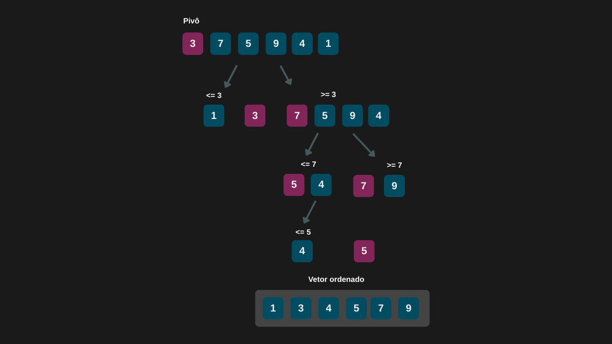

---

comments: true

---

# **Ordenação usando o método de ordenação rápida (Quick Sort)**

O algoritmo de ordenação rápida (Quick Sort) funciona por meio de comparações e utiliza a estratégia de dividir para conquistar para ordenar os elementos. Essa estratégia consiste em dividir o vetor (ou lista) em subvetores menores, que são resolvidos de forma recursiva.

O ponto central do algoritmo é a escolha de um pivô, que serve como base para reorganizar os elementos: os menores que o pivô são movidos para um lado, e os maiores, para o outro. Após essa separação, o algoritmo aplica o mesmo processo a cada subvetor, até que todos os elementos estejam ordenados.

Como resultado, o Quick Sort é um dos algoritmos de ordenação mais eficientes e amplamente utilizados, especialmente em grandes conjuntos de dados.

## **Algoritmo**

O Quick Sort funciona da seguinte forma:

1. Escolha um `pivô`: selecione um elemento do vetor que servirá como referência para a ordenação.

2. Particione o vetor: reorganize os elementos de forma que os menores que o `pivô` fiquem à esquerda e os maiores, à direita.

3. Recursivamente, aplique o algoritmo: repita o processo de escolha do `pivô` e particionamento nos subvetores da esquerda e da direita.

4. Continue dividindo: o processo se repete até que todos os subvetores tenham no máximo um elemento — o que significa que estão ordenados.

5. Ao final, todos os elementos estarão na posição correta, resultando em um vetor ordenado.

## **Complexidade**

A complexidade do Quick Sort varia de acordo com a escolha do `pivô` e a distribuição dos elementos. No melhor e no caso médio, sua complexidade é `O(n log n)`, o que indica que o número de operações cresce de forma logarítimica em relação ao tamanho do vetor. Isso acontece quando o pivô consegue dividir os dados de maneira equilibrada. No entanto, no pior caso — quando o pivô escolhido é o menor ou o maior elemento do vetor — a divisão fica extremamente desbalanceada, levando a uma complexidade de `O(n²)`.

Sua performance do algoritmo pode ser resumida da seguinte forma:

| Caso         | Complexidade |
|--------------|--------------|
| Melhor caso  | O(n log n)   |
| Caso médio   | O(n log n)   |
| Pior caso    | O(n²)        |

!!! tip "Uso no dia-a-dia"

    Esse algoritmo é amplamente utilizado em aplicações comerciais e já vem implementado de forma otimizada em muitas linguagens de programação modernas.

## **Implementação**

```csharp

 public class QuickSort
 {
     public int[] Sort(int[] vetor, int esquerda, int direita)
     {
         if (esquerda < direita)
         {
             int pivo = Particionemento(vetor, esquerda, direita);
             Sort(vetor, esquerda, pivo - 1);
             Sort(vetor, pivo + 1, direita);
         }

         return vetor;
     }

     private int Particionemento(int[] vetor, int esquerda, int direita)
     {
         int pivo = vetor[esquerda];
         int indicePivo = esquerda;

         for (int i = esquerda + 1; i <= direita; i++)
         {
             if (vetor[i] < pivo)
             {
                 indicePivo++;
                 Swap(vetor, i, indicePivo);
             }
         }

         Swap(vetor, esquerda, indicePivo);

         return indicePivo;
     }

    private void Swap(int[] vetorDesordenado, int esquerda, int direita)
        => (vetorDesordenado[direita], vetorDesordenado[esquerda]) = 
            (vetorDesordenado[esquerda], vetorDesordenado[direita]);
 }
```

=== "Quick Sort"

    