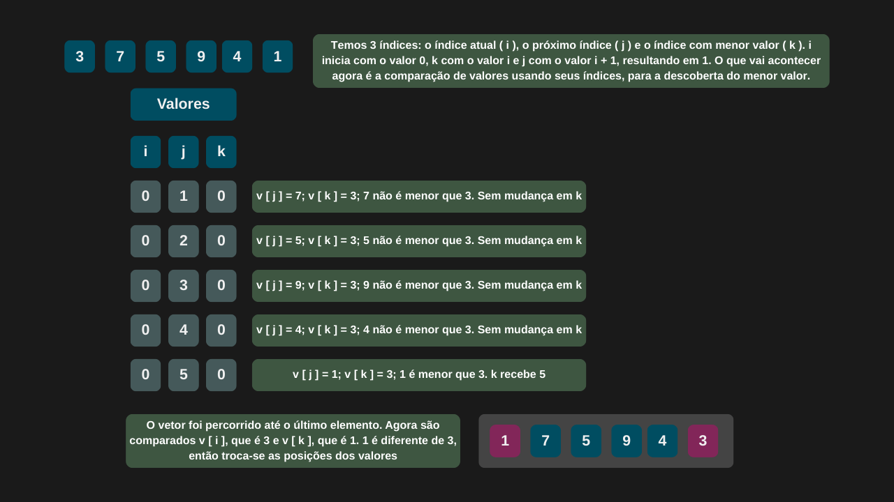
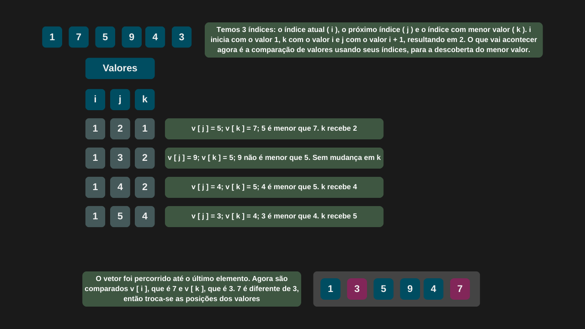
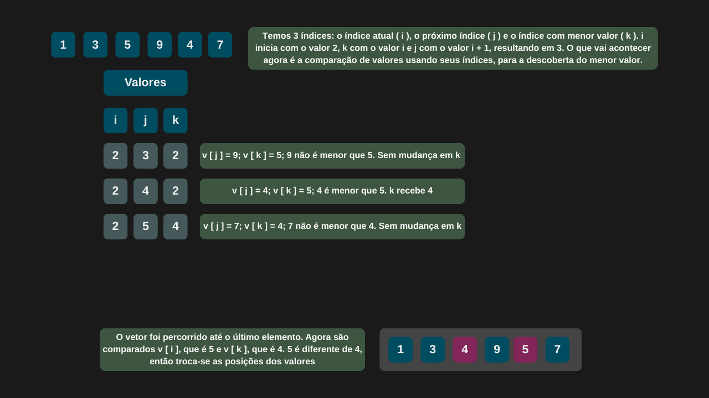
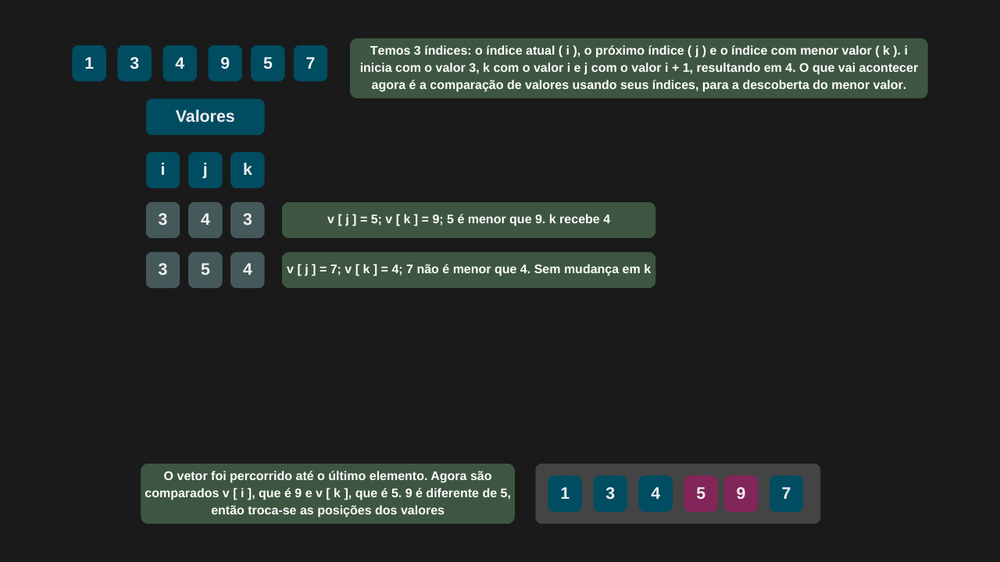
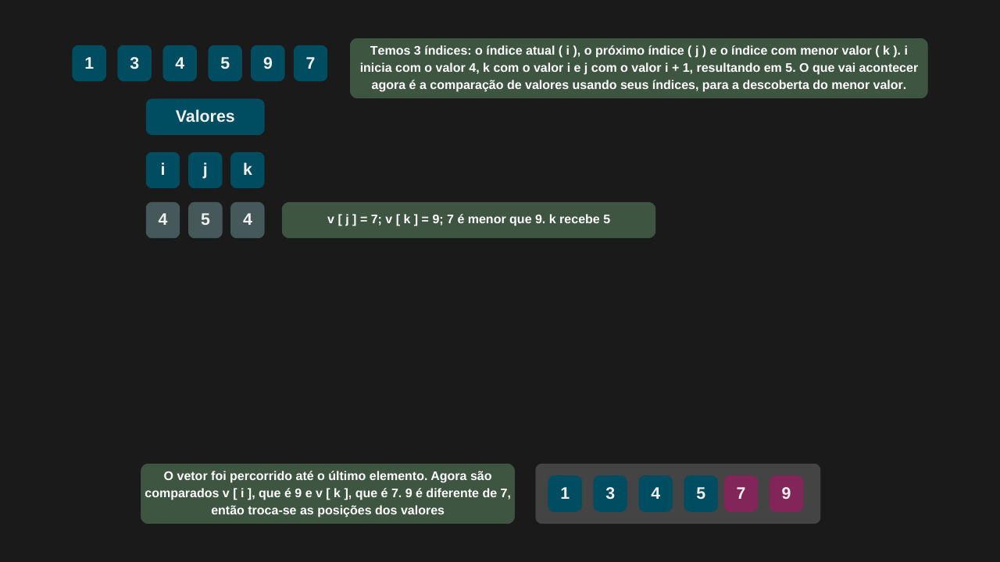

---

comments: true

---

# **Ordenação usando o método de seleção (Selection Sort)**

O algoritmo de ordenação por seleção (Selection Sort) funciona selecionando repetidamente o menor elemento da parte não ordenada do vetor e movendo-o para a posição correta na parte ordenada.

O processo se repete para as próximas posições, até que todo o vetor esteja ordenado. Em outras palavras, o algoritmo encontra o menor valor e o coloca na primeira posição, depois encontra o segundo menor e o coloca na segunda posição, e assim por diante, realizando esse procedimento `n - 1` vezes.

## **Algoritmo**

O algoritmo Selection Sort funciona da seguinte maneira:

1. Dado um vetor com n elementos, inicia-se um laço externo que percorre os elementos do índice `0` até `n - 1`. Esse índice é chamado de indiceAtual.

2. Assumimos inicialmente que o menor valor está na posição atual, ou seja: `indiceMenorValor = indiceAtual`.

3. Em seguida, um laço interno percorre os elementos à frente (do índice `indiceAtual + 1` até `n - 1`) buscando o menor valor.

4. Sempre que for encontrado um elemento menor do que o atual `indiceMenorValor`, atualizamos o `indiceMenorValor` com o índice desse novo menor valor.

5. Após o término do laço interno, se o valor encontrado (em `indiceMenorValor`) for diferente do valor atual (em `indiceAtual`), os dois são trocados.

6. O processo se repete até que o vetor esteja completamente ordenado ao fim do laço externo.

## **Complexidade**

Em termos de desempenho, o Selection Sort possui complexidade quadrática, representada por `O(n²)`. Isso ocorre porque, independentemente da ordem inicial dos elementos, ele sempre realiza o mesmo número de comparações. Assim, sua performance é a mesma nos casos:

| Caso         | Complexidade |
|--------------|--------------|
| Melhor caso  | O(n²)        |
| Caso médio   | O(n²)        |
| Pior caso    | O(n²)        |

!!! tip "Uso no dia-a-dia"

    Apesar de sua simplicidade e fácil implementação, não é recomendado para grandes conjuntos de dados devido à sua baixa eficiência em termos de tempo de execução.

## **Implementação**

```csharp

public class SelectionSort
{
    public int[] Sort(int[] vetor)
    {
        int indiceMenorValor;
        int quantidadeElementos = vetor.Length;

        for (int indiceAtual = 0; indiceAtual < quantidadeElementos - 1; indiceAtual++)
        {
            indiceMenorValor = indiceAtual;

            for (int proximoIndice = indiceAtual + 1; proximoIndice < quantidadeElementos; proximoIndice++)
            {
                if (vetor[proximoIndice] < vetor[indiceMenorValor])
                    indiceMenorValor = proximoIndice;
            }

            if (vetor[indiceAtual] != vetor[indiceMenorValor])
                Swap(vetor, indiceAtual, indiceMenorValor);
        }

        return vetor;
    }    

    private void Swap(int[] vetorDesordenado, int indiceAtual, int indiceMenorValor)
        => (vetorDesordenado[indiceMenorValor], vetorDesordenado[indiceAtual]) = 
            (vetorDesordenado[indiceAtual], vetorDesordenado[indiceMenorValor]);    
}

```

=== "Selection Sort 1"

    

=== "Selection Sort 2"

    

=== "Selection Sort 3"

    

=== "Selection Sort 4"

    

=== "Selection Sort 5"

    