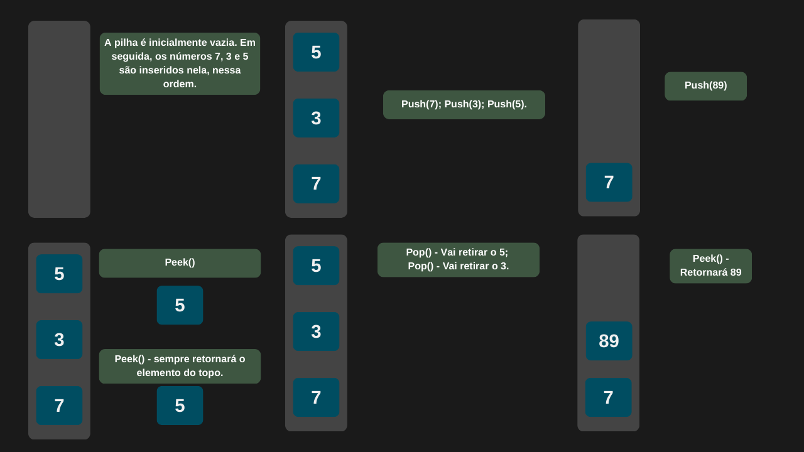

---

comments: true

---

# **Pilhas e suas operações**

Pilhas são estruturas de dados do tipo `LIFO (Last In, First Out)`, nas quais o último elemento inserido é o primeiro a ser removido. Funcionam como uma pilha de livros ou pratos, onde apenas o topo está acessível. Suas principais operações são: `push`, para inserir um novo elemento no topo; `pop`, para remover o elemento do topo; `peek` (ou `top`), para visualizar o elemento no topo sem removê-lo; e `isEmpty`, para verificar se a pilha está vazia.

## **Inserção de dados (push)**

Ao inserir dados em uma pilha, se ela estiver cheia, é necessário redimensionar seu tamanho para acomodar os novos elementos. Esse redimensionamento envolve a criação de um novo array e a cópia de todos os elementos existentes, resultando em uma complexidade de tempo `O(n)`. No entanto, quando há espaço disponível, a inserção é direta e ocorre em tempo constante, com complexidade `O(1)`.

## **Remoção de dados (pop)**

A remoção de elementos em uma pilha ocorre sempre no topo, o que torna essa operação simples e direta, com complexidade de tempo constante, ou seja, `O(1)`.

## **Retornando o elemento do topo (peek)**

Quando pegamos o elemento do topo da pilha, não é necessário percorrê-la, pois o elemento já está na posição correta, ou seja, no topo da estrutura. Isso resulta em uma operação de complexidade constante, `O(1)`.

## **Verificando se a pilha está vazia**

A verificação de se a pilha está vazia é realizada por meio de uma simples comparação com o elemento do topo. Portanto, a operação possui complexidade `O(1)`.

## **Implementação**

```csharp

public class Pilha
{
    private int[] itens;
    private int topo;
    private const int capacidade = 10;

    public Pilha()
    {
        itens = new int[capacidade];
        topo = -1;
    }

    public void Push(int item)
    {
        if (topo == itens.Length - 1)
            Redimensionar();

        topo = topo + 1;
        itens[topo] = item;
    }

    public int Pop()
    {
        if (IsEmpty())
            throw new InvalidOperationException("A pilha está vazia.");

        int item = itens[topo];
        itens[topo] = default;
        topo = topo - 1;

        return item;
    }

    public int Peek()
    {
        if (IsEmpty())
            throw new InvalidOperationException("A pilha está vazia.");

        return itens[topo];
    }

    public bool IsEmpty() => topo == -1;

    public int Tamanho() => topo + 1;

    private void Redimensionar()
    {
        int novaCapacidade = capacidade * 2;
        int[] novosItens = new int[novaCapacidade];

        for (int indice = 0; indice < itens.Length; indice++)
            novosItens[indice] = itens[indice];

        itens = novosItens;
    }
}

```

```csharp

    Pilha pilha = new Pilha();
    pilha.Push(10);
    Console.WriteLine($"O elemento {pilha.Peek()} foi adicionado na pilha.");

    pilha.Push(15);
    Console.WriteLine($"O elemento {pilha.Peek()} foi adicionado na pilha.");

    pilha.Push(20);
    Console.WriteLine($"O elemento {pilha.Peek()} foi adicionado na pilha.");
    
    Console.WriteLine($"O elemento {pilha.Pop()} foi removido da pilha.");
    Console.WriteLine($"O elemento {pilha.Pop()} foi removido da pilha.");
    Console.WriteLine($"O elemento {pilha.Pop()} foi removido da pilha.");

```

=== "Operações em uma pilha"

    