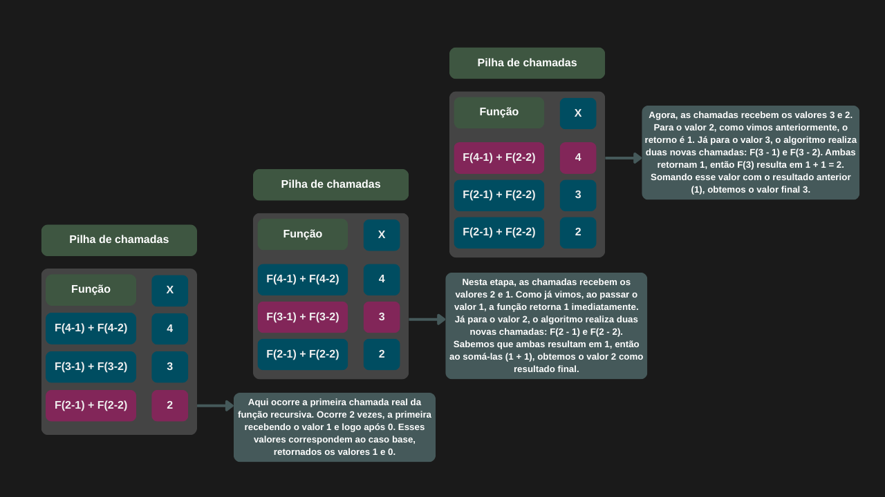

---

comments: true

---

# Sequência de Fibonacci

Um dos problemas conhecidos quando se fala em recursão é a sequência de Fibonacci. Trata-se de uma série de números inteiros que normalmente começa em zero e um, em que cada número seguinte é a soma dos dois anteriores. Essa sequência aparece com frequência em diversos fenômenos da natureza.

Matematicamente, ela é definida pela fórmula `fn = (fn - 1) + (fn - 2)`. A sequência fica assim: 0, 1, 1, 2, 3, 5, 8, 13, 21, 34, 55, 89,144, 233...

Vamos analisar como calcular o n-ésimo elemento dessa sequência utilizando recursão. Queremos o 4° número da sequência (desconsiderando o zero).

```csharp

public int Fibonacci(int numero)
{
    if (numero < 2)
        return numero;

    else
        return Fibonacci(numero - 1) + Fibonacci(numero - 2);
}

```

