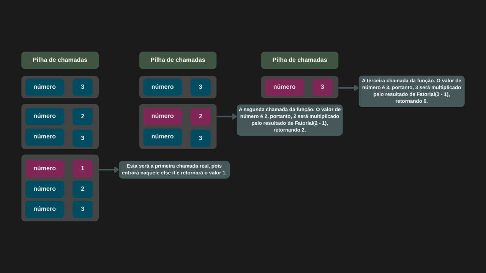

---

comments: true

---

# **Funções recursivas**

Funções recursivas são aquelas que chamam a si mesmas dentro do seu próprio bloco de código. Dessa forma, conseguemcriar iterações até que o objetivo do algoritmo seja alcançado. A sua última chamada é conhecido como **caso base**.

Como a função se chama a si mesma, é necessário ter cuidado para não acabar em um _loop_ infinito.

Essas chamadas são armazenadas na memória em uma estrutura chamada pilha de chamadas, ou _call stack_. A chamada do caso base  fica no topo dessa pilha e nenhumas das chamadas anteriores será finalizada até que o resultado das chamadas seguintes sejam calculados.

O código abaixo calcula o fatorial de um número. Vamos analisar como o mesmo funciona.

```csharp

public class Fatorial
{
    public int CalcularFatorial(int numero)
    {
        if (numero < 0)
            return -1;

        else if (numero is 0 or 1)
            return 1;

        else
            return numero * CalcularFatorial(numero - 1);
    }
}

```

 Se for utilizado um número válido (maior ou igual a 0), podemos perceber que o caso base da função recursiva retorna 1. Se utilizarmos o número 3, a função se chamará algumas vezes, decrementando o valor em 1 a cada chamada, até que a condição do `else if` seja satisfeita. A partir daí, os calculos começarão a ser feitos na ordem inversa, conforme as chamadas anteriores forem sendo resolvidas.


