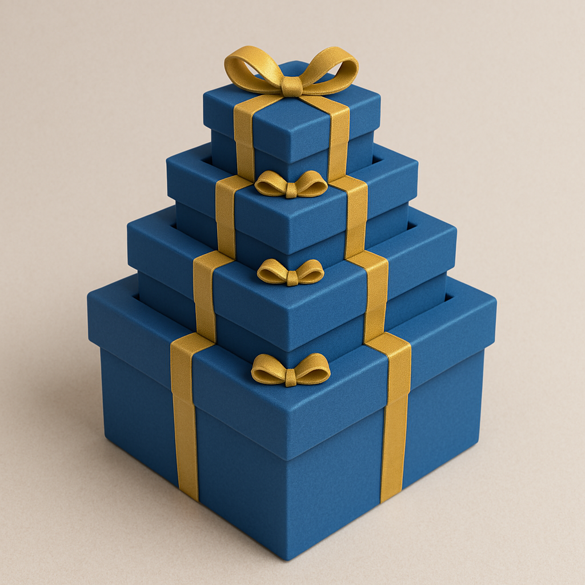

# **Introdução à recursividade**

Hoje é o aniversário de Beatriz. Muito animada, ela decidiu comemorar com uma festa, chamando suas amigas. Sabrina, uma de suas amigas, resolveu fazer uma brincadeira com o presente que preparou especialmente para ela.

Assim que chegou a festa, Sabrina entregou a Beatriz um presente cuidadosamente embrulhadado com papel de aniversário. Ao rasgar o embrulho, Beatriz encontrou uma caixa. Ao abri-la, havia outra caixa dentro. E dentro dela, mais uma. E assim por diante.

Após abrir 6 caixas, finalmente encontrou seu presente.

Essa brincadeira é uma metáfora perfeita para recursão. Assim como Beatriz foi abrindo caixas cada vez menores até chegar ao objetivo final, uma função recursiva se chama repetidamente, sempre com problemas menores, até alcançar o caso base — o ponto onde não há mais caixas para abrir.

A partir daí, todo o processo começa a se desfazer:
cada chamada da função vai sendo resolvida, uma por uma, como se estivéssemos fechando as caixas de volta, até tudo estar completo.

Vários algoritmos importates utilizam recursão, tornando fundamental compreendermos como ela funciona.

[2.1 Funções recursivas](../recursividade/funcoes-recursivas.md)

[2.2 Sequência de Fibonacci](../recursividade/fibonacci.md)