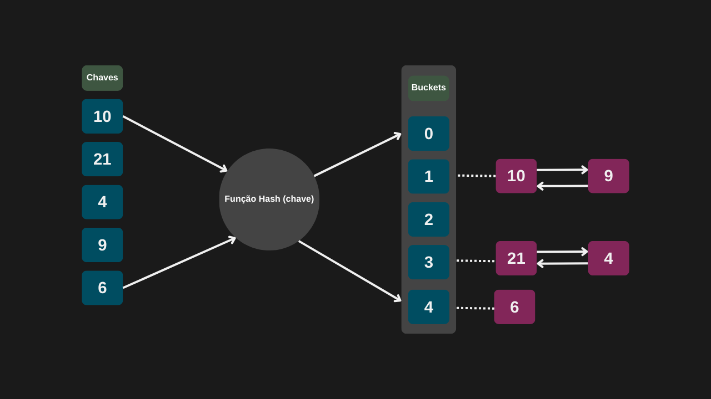
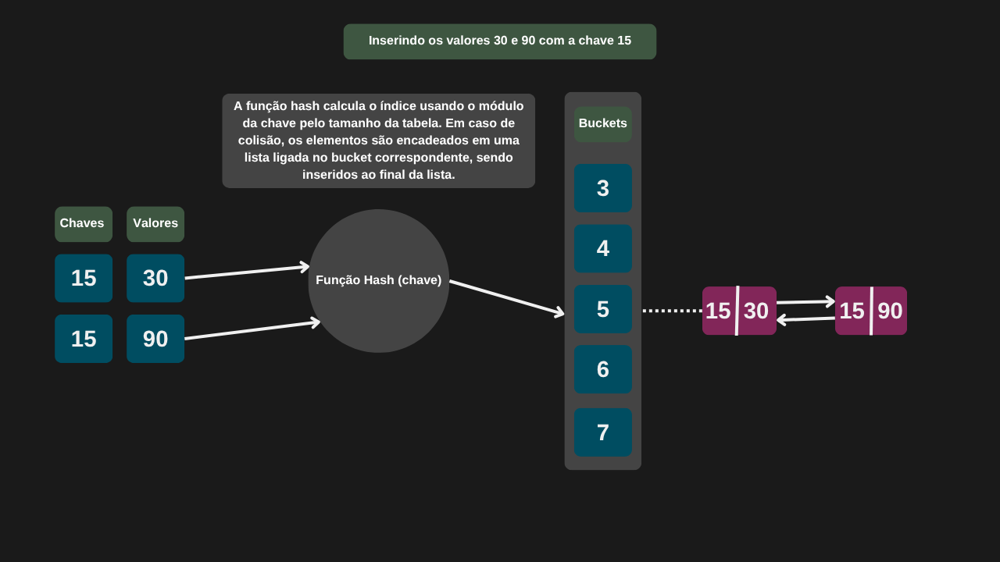
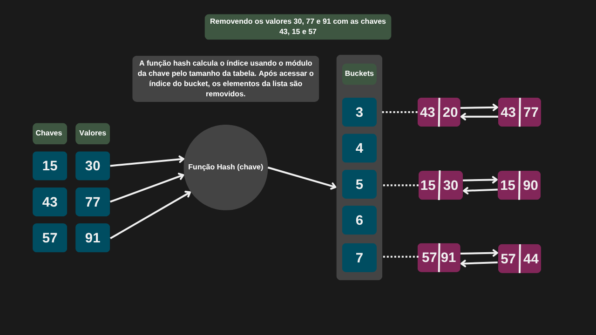
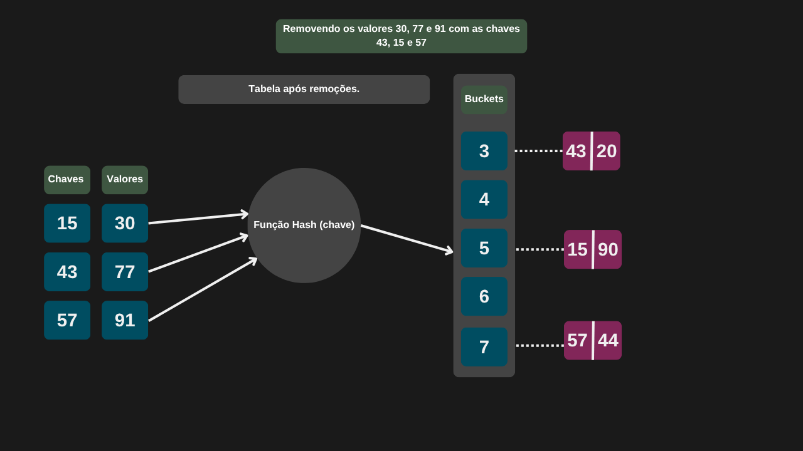

---

comments: true

---

# **Tabelas Hash**

A tabela hash é uma estrutura de dados que armazena pares chave-valor. Por meio de uma função chamada função hash, a chave é convertida em um índice numérico, indicando exatamente onde o valor correspondente será armazenado na tabela. Com isso, conseguimos acesso direto e eficiente aos dados, sem precisar percorrer todos os elementos da estrutura.

A implementação será feita utilizando um vetor de listas duplamente encadeadas. Cada posição do vetor atuará como um *bucket*, e os elementos serão armazenados nos nós das listas.



## **Função Hash**

Uma função hash é uma função que recebe uma chave (geralmente de qualquer tipo) e a transforma em um número inteiro, chamado de índice ou código hash, que será usado para armazenar ou localizar rapidamente essa chave em uma estrutura de dados, como uma tabela hash.

Dessa forma, espera-se distribuir as chaves de forma uniforme pelos índices disponíveis, garantir que a mesma chave produza sempre o mesmo índice e reduzir colisões (quando duas chaves diferentes geram o mesmo índice).

## **Complexidade**

A eficiência de uma tabela hash depende diretamente da qualidade da função hash utilizada e da estratégia adotada para tratar colisões. Esses dois fatores influenciam diretamente a complexidade das operações.
No caso médio, quando a função hash distribui bem as chaves e há poucos elementos por balde, o acesso é praticamente direto, resultando em complexidade `O(1)`.
Por outro lado, no pior cenário — quando muitas chaves colidem e são agrupadas no mesmo balde — a estrutura se comporta como uma lista encadeada, elevando a complexidade para `O(n)`.

| Caso         | Complexidade |
|--------------|--------------|
| Melhor caso  | O(1)         |
| Caso médio   | O(1)         |
| Pior caso    | O(n)         |


## **Implementação**

```csharp

public class TabelaHash
{
    private readonly int Tamanho;
    public readonly LinkedList<(int chave, int valor)>[] Tabela;

    public TabelaHash(int tamanho)
    {
        Tamanho = tamanho;
        Tabela = new LinkedList<(int, int)>[tamanho];

        for (int i = 0; i < tamanho; i++)
            Tabela[i] = new LinkedList<(int, int)>();
    }

    private int FuncaoHash(int chave)
    {
        int hash = chave % Tamanho;

        if (hash < 0)
            hash = hash + Tamanho;

        return hash;
    } 
}

```

## **Pesquisa de dados**

Durante a pesquisa de dados, aplicamos a função hash à chave fornecida para determinar o índice correspondente na tabela. Em seguida, percorremos a lista ligada presente nesse índice e retornamos todos os valores associados àquela chave.mk

### **Implementação**

```csharp

public List<int> Pesquisar(int chave)
{
    int indice = FuncaoHash(chave);
    LinkedList<(int chave, int valor)> linhaTabelaHash = Tabela[indice];

    List<int> valores = new();

    foreach ((int chaveAtual, int valor) in linhaTabelaHash)
    {
        if (chaveAtual == chave)
            valores.Add(valor);
    }

    return valores;
}

```

## **Inserção de dados**

Durante a inserção de um novo par chave-valor, a função hash é utilizada para calcular o índice do bucket correspondente na tabela. Esse índice determina em qual posição do array a chave será armazenada. Em seguida, o par é inserido no final da lista ligada associada a esse bucket, preservando a ordem de inserção entre elementos que colidem (ou seja, que compartilham o mesmo índice).

### **Implementação**

```csharp

public int Inserir(int chave, int valor)
    {
        int indice = FuncaoHash(chave);
        LinkedList<(int chave, int valor)> linhaTabelaHash = Tabela[indice];

        foreach ((int chave, int valor) par in linhaTabelaHash)
        {
            if (par.chave == chave)
                return -1;                
        }

        linhaTabelaHash.AddLast((chave, valor));
        return indice;
    }

```




## **Remoção de dados**

Na remoção, a função hash é usada para localizar o bucket correspondente. Em seguida, percorremos a lista ligada nesse bucket até encontrar e remover o nó com a chave desejada.

### **Implementação**

```csharp

public bool Remover(int chave, int valor)
{
    int indice = FuncaoHash(chave);
    LinkedList<(int chave, int valor)> linhaTabelaHash = Tabela[indice];

    bool elementoRemovido = false;
    LinkedListNode<(int chave, int valor)>? atual = linhaTabelaHash.First;

    while (atual is not null)
    {
        LinkedListNode<(int chave, int valor)>? proximo = atual.Next;

        if (atual.Value.chave == chave && atual.Value.valor == valor)
        {
            linhaTabelaHash.Remove(atual);
            elementoRemovido = true;
        }

        atual = proximo;
    }

    return elementoRemovido;
}

```

=== "Remoção de dados 01"

    

=== "Remoção de dados 02"

    