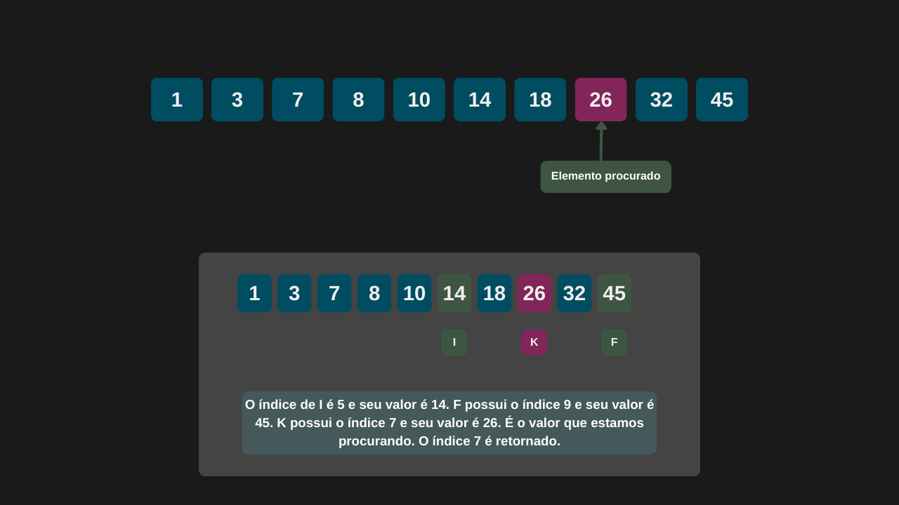

---

comments: true

---

# **Pesquisa binária**

A pesquisa binária é um algoritmo de pesquisa baseado na estratégia de dividir e conquistar. Ele é aplicado a vetores e listas ordenadas, reduzindo pela metade a área de pesquisa a cada iteração até encontrar o elemento desejado. 

Sua eficiência se destaca em relação à pesquisa linear, pois evita a necessidade de examinar todos os elementos do vetor, tornando a pesquisa significativamente mais rápida.

# **Algoritmo**

O algoritmo da pesquisa binária segue os seguintes passos:

1. Crie uma iteração (loop) que execute enquanto o índice inicial `I` seja menor ou igual ao indice final `F`

2. Calcule o índice do meio (**K**) do vetor:  
  `(I + F) / 2`.

3. Compare o valor do elemento no índice **K** com o elemento procurado:  
    3.1. Se o valor em **K** for **menor** que o procurado, atualize o índice inicial para `K + 1`.  
    3.2 Se o valor em **K** for **maior** que o procurado, atualize o índice final para `K - 1`.  
    3.3 Se o valor em **K** for **igual** ao procurado, retorne `K`.  

4. Repita os passos 2 e 3 até encontrar o elemento ou até que o índice inicial seja maior que o índice final.  

5. Se o valor **não estiver no vetor**, retorne `-1`.  

# **Implementação**

```csharp

public class PesquisaBinaria
{
    public int ExecutarPesquisaBinaria(int[] vetor, int elementoProcurado)
    {
        int inicio = 0;
        int fim = vetor.Length - 1;
        int meio = 0;

        while (inicio <= fim)
        {
            meio = (inicio + fim) / 2;

            if (vetor[meio] == elementoProcurado)
                return meio;

            else if (vetor[meio] < elementoProcurado)
                inicio = meio + 1;
            else
                fim = meio - 1;
        }

        return -1;
    }    
}

```

```csharp

int[] vetor = [ 1, 3, 7, 8, 10, 14, 18, 26, 32, 45 ];
int elementoProcurado = 26;

int indiceElementoProcurado = PesquisaBinaria.ExecutarPesquisaBinaria(vetor, elementoProcurado);

Console.WriteLine($"O elemento {elementoProcurado} foi encontrado na posição {indiceElementoProcurado} no vetor.");

```

=== "Iteração 1"

    

=== "Iteração 2"

    