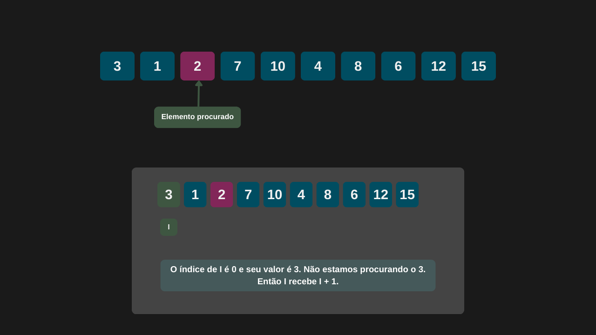
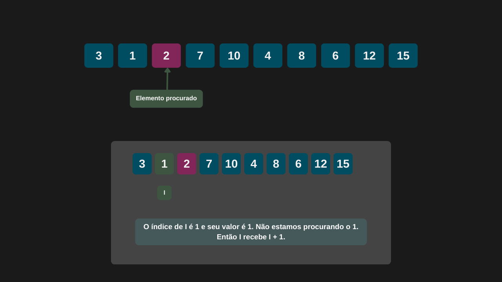
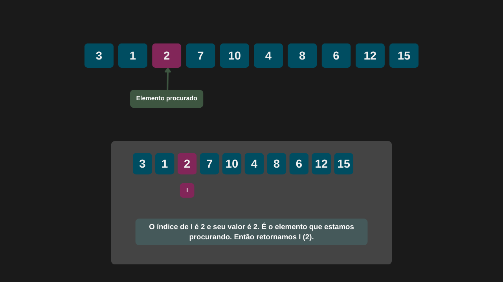

---

comments: true

---

# **Pesquisa simples (sequencial)**

Quando for necessário procurar dados em um vetor, é possível fazer uma pesquisa sequencial. Esse método percorre o vetor elemento por elemento, verificando se o valor atual corresponde ao valor procurado. Se houver uma correspondência, o índice do elemento é retornado imediatamente.

# **Algoritmo**

O algoritmo da pesquisa simples segue os seguintes passos:

1. Determine o tamanho do vetor `T`.

2. Percorra o vetor do índice inicial `I` até `T - 1`.

3. Se o elemento no índice atual for igual ao valor procurado, retorne esse índice.

4. Se o elemento não for encontrado, retorne `-1`.

# **Implementação**


```csharp

 public class PesquisaSimples
{
    public int ExecutarPesquisaSimples(int[] vetor, int elementoProcurado)
    {
        for (int indice = 0; indice < vetor.Length - 1; indice = indice + 1)
        {
            if (vetor[indice] == elementoProcurado)
                return indice;
        }

        return -1;
    }    
}

```

=== "Iteração 1"

    

=== "Iteração 2"

    

=== "Iteração 3"

    