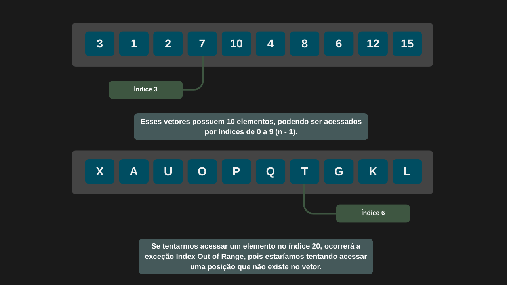

---
date:
    created: 03-30-2025
draft: true
readtime: 5
comments: true
---

# **Uso básico de vetores (Array)**

Vetores são estruturas de dados que armazenam uma sequência de elementos, todos do mesmo tipo. Esses elementos podem ser números, strings, objetos, ou até mesmo outros vetores.

Em programação, os vetores são frequentemente chamados de arrays (ou listas, dependendo da linguagem). Eles são uma forma eficaz de organizar dados para facilitar o acesso, manipulação e processamento.



```csharp

int[] vetor = { 3, 1, 2, 7, 10, 4, 8, 6, 12, 15 }; 

```

## **Operações em vetores**

Para manipular vetores, precisamos acessar seus índices. Vamos ver como isso funciona na prática.

### **Acessando seus elementos**

Para acessar valores em um vetor, utilizamos seus índices, que variam de `0` até `n - 1` (onde n é o tamanho do vetor). Se tentarmos acessar a posição 20, por exemplo, ocorrerá a exceção **IndexOutOfRangeException**.

```csharp

 int[] vetor = { 3, 1, 2, 7, 10, 4, 8, 6, 12, 15 }; 
 
 Console.WriteLine(vetor[5]); // 4     

 Console.WriteLine(vetor[20]); // Index out of range 

```

!!! note "Adição de elementos"

    Não é possível adicionar elementos em um vetor de tamanho fixo. Seria necessário criar outro vetor, copiar os elementos do primeiro para o segundo e então adicionar os novos elementos.

### **Adição de elementos**

Para adicionar elementos, criaremos um novo vetor. O tamanho desse novo vetor será igual ao tamanho do vetor original somado à quantidade de novos elementos.

```csharp

int[] vetorAnterior = { 3, 1, 2, 7, 10, 4, 8, 6, 12, 15 };  
int novoElemento = 29;

int[] vetorNovo = new int[vetorAnterior.Length + 1];

```

Após criar o novo vetor com o tamanho expandido, basta inserir os elementos nele e, em seguida, atualizar o vetor original.

```csharp

Array.Copy(vetorAnterior, vetorNovo, vetorAnterior.Length);

vetorNovo[vetorNovo.Length - 1] = novoElemento;

vetorAnterior = vetorNovo;

```

!!! warning "Cuidado com o índice"

    Cuidado para não acessar uma posição além do tamanho do vetor. Isso resultará na exceção **IndexOufOfRange**.